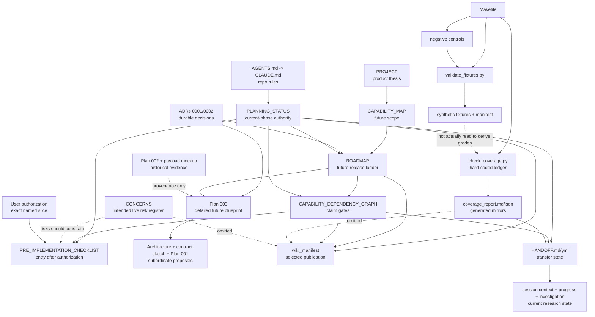

# Mixed Methods Workbench Artifact-Authority Investigation

Date: 2026-07-12
Status: research report for the SOTA-program planning lane; no implementation authority
Scope: every repository-local documentation, plan, ADR, handoff, fixture/manifest, script/check, generated report, and hidden planning/research artifact present at the inventory freeze
Mutation boundary: this report is the only file created by this lane; no source, canonical document, fixture, generated report, or producer repository was edited

> **Sources consulted:** all 35 tracked worktree artifacts, the worktree control file, and all four untracked planning/research artifacts present at the 2026-07-12 inventory freeze. The exhaustive path list is in [Consulted-file inventory](#consulted-file-inventory). `AGENTS.md` was consulted through its `CLAUDE.md` symlink target. No repository artifact was skipped. The external URLs listed inside roadmap documents were inventoried as part of those local documents but were not independently opened or treated as current SOTA evidence in this lane.
>
> **Status:** first complete artifact-authority pass. Re-run the inventory when any canonical planning file, handoff, validator, coverage row, fixture manifest, or concurrent research artifact changes.

## Executive answer

The repository has a clear *intended* authority ladder, but it does not yet have a single internally consistent, machine-checkable planning system. The strongest authority is the current-phase rule in `CLAUDE.md` and `docs/PLANNING_STATUS.md`: the repo is documentation-only, and implementation needs explicit authorization of a named slice (`CLAUDE.md:3-11`; `docs/PLANNING_STATUS.md:6-14`, `docs/PLANNING_STATUS.md:36-40`). `PROJECT.md`, the capability map, roadmap, capability dependency graph, pre-implementation checklist, ADRs, and Plan 003 then define the thesis, scope, future order, claim gates, entry process, permanent decisions, and detailed future blueprint (`docs/PLANNING_STATUS.md:52-68`).

Three findings materially change how the long-term program should be planned:

1. **The immediate T0/W2 takeover instruction is not authorized by the canonical phase rules.** The machine handoff says to run the pre-implementation checklist and close T0/W2 (`.claude/handoff.yml:8`), and the human handoff calls manifest/negative-control work immediately safe (`.claude/HANDOFF.md:47-55`). The checklist says it may be used only *after* a named authorization and otherwise work must stop at planning (`docs/PRE_IMPLEMENTATION_CHECKLIST.md:8-14`); Plan 003 says none of its 0.0 work may execute without a separate named instruction (`docs/plans/003_integration_versioning_and_clean_state.md:10-20`). Until Brian names T0/W2 or another row, the safe next artifact is a documentation-only T0 specification and authority reconciliation, not validator/manifest implementation. Confidence: high.
2. **The coverage surface is a manually authored status narrative rendered by code, not evidence-derived coverage.** All eight grades are constants in `scripts/check_coverage.py:35-158`, and `_build_report()` merely counts and serializes those constants (`scripts/check_coverage.py:177-195`). That falls short of Plan 003's required independent recomputation and deliberate evidence-removal control (`docs/plans/003_integration_versioning_and_clean_state.md:299-312`). Temporary probes also showed that an empty QC payload, unsupported QC/PT/Theory schema majors, an unanchored assertion marked supported, a missing residual-hypothesis reference, and an unlisted extra artifact all pass the current validator; the code validates only manifest path/hash/grade fields and a subset of synthesis relationships (`scripts/validate_fixtures.py:63-92`, `scripts/validate_fixtures.py:95-115`, `scripts/validate_fixtures.py:118-188`). Confidence: high.
3. **The synthetic-fixture provenance closure criterion is internally impossible as written.** The fixtures explicitly were not generated by producer engines (`examples/fixtures/workbench_contract_v1/README.md:3-5`), while W2 requires every current fixture to have an engine commit and says pending placeholders are not evidence (`docs/coverage_report.json:74-85`). The manifest correctly makes real producer provenance a *replacement* gate (`examples/fixtures/workbench_contract_v1/manifest.json:35-39`), but the handoff asks the current synthetic inventory to record real producer commits while remaining synthetic (`.claude/HANDOFF.md:49-55`). A truthful manifest needs a discriminated origin: workbench-authored synthetic provenance versus engine-produced real provenance. Confidence: high.

These are planning-system defects, not evidence that the broad thesis is wrong. The canonical method boundaries, thin-slice strategy, and bounded-claim discipline are coherent (`docs/adr/0002_broad_north_star_versioned_thin_slices.md:34-81`). The next dependency is to make authority and evidence semantics internally consistent before converting the long-term roadmap into execution.

## Investigation atoms

| ID | Question | Dependencies | Status | Answer |
|---|---|---|---|---|
| A2.1 | What local artifacts exist, including hidden/session and generated artifacts? | None | Closed | 35 tracked artifacts, one worktree control file, and four concurrent untracked planning/research files were present at freeze time. Empty planning directories were also recorded. |
| A2.2 | Which artifacts are canonical, subordinate, historical, generated, or session-local? | A2.1 | Closed | The authority ladder is explicit in `docs/PLANNING_STATUS.md:52-68`, but several subordinate and handoff artifacts conflict with it. |
| A2.3 | What is the current artifact dependency graph? | A2.1-A2.2 | Closed | Current-phase authority, future strategy, executable fixture checks, generated coverage, publication metadata, and session handoff form separate but incompletely reconciled branches. |
| A2.4 | Which conflicts can cause an agent to take the wrong action or license the wrong claim? | A2.2-A2.3 | Closed | Authorization, T0/W2 meaning, coverage derivation, PT seam, 0.4 prerequisites, schema versioning, and handoff commit metadata conflict. |
| A2.5 | Which planning, research, and verification artifacts are missing? | A2.3-A2.4 | Closed | No canonical authority registry, current goal doc, evidence-derived coverage model, typed schemas, compatibility manifest, governed source bundle, current SOTA benchmark spec, or independent sign-off package exists. |
| A2.6 | What dependency-ordered repairs should feed the long-term SOTA program? | A2.4-A2.5 | Closed | Reconcile authority first, complete current research/goal artifacts, define T0 evidence semantics, obtain named authorization, then advance producer and product slices under observed gates. |

## Assumptions register

| # | Assumption | Confidence | How verified | Round | Status |
|---|---|---:|---|---:|---|
| 1 | “Local artifacts” in this lane means the goal worktree; producer readiness is handled by the parallel producer lane. | High | Task scope and `.claude/tasks/session_context.md:25-30`; producer report declares its separate scope at `.claude/tasks/research_producer_readiness.md:1-5`. | 1 | Confirmed |
| 2 | Explicit status/supersession statements control over older prose when both are repository-local. | High | `docs/PLANNING_STATUS.md:52-68` and Plan 003's supersession statement at `docs/plans/003_integration_versioning_and_clean_state.md:1-8`. | 1 | Confirmed |
| 3 | A handoff transfers state but cannot expand implementation authority beyond canonical project rules. | High | `CLAUDE.md:8-11`, `docs/PRE_IMPLEMENTATION_CHECKLIST.md:8-14`, and `.claude/HANDOFF.md:170-175`. | 1 | Confirmed |
| 4 | Generated coverage is authoritative only for what its generator actually derives. | High | Generator inspection at `scripts/check_coverage.py:35-195` and exact-output comparison; current files match the generator, but grades are constants. | 2 | Confirmed |
| 5 | Passing `make check` establishes exactly the implemented fixture invariants, not a complete contract. | High | `Makefile:15-29`, validator inspection, six controls at `scripts/check_fixture_negative_controls.py:20-59`, and temporary adversarial probes. | 2 | Confirmed |
| 6 | External methodological links in local docs are not fresh SOTA evidence unless independently checked with access dates. | High | The current session explicitly requires direct primary URLs, access dates, uncertainty, and freshness triggers (`.claude/tasks/session_context.md:32-38`); the capability graph itself says external SOTA was not refreshed (`docs/CAPABILITY_DEPENDENCY_GRAPH.md:135-139`). | 2 | Confirmed |
| 7 | A missing file found by exhaustive inventory is absent as of the freeze, not permanently absent. | High | `git ls-files`, hidden-file enumeration, and directory listing were run at freeze time. | 2 | Confirmed; freshness-sensitive |

## Consulted-file inventory

### Root and control artifacts

- `.git` — one-line worktree pointer; consulted only to confirm worktree control, not treated as planning authority.
- `.gitignore` — current repository hygiene configuration; `worktrees/` is ignored (`.gitignore:1-9`).
- `AGENTS.md` — symlink to `CLAUDE.md`; no divergent Codex mirror exists.
- `CLAUDE.md` — canonical repository instructions and authorization boundary (`CLAUDE.md:3-11`, `CLAUDE.md:13-38`).
- `PROJECT.md` — canonical product thesis and canonical-document index (`PROJECT.md:3-61`, `PROJECT.md:63-86`).
- `README.md` — current reader entrypoint and bounded scaffold claim (`README.md:6-24`, `README.md:26-40`).
- `Makefile` — current executable command surface (`Makefile:10-29`).

### Hidden handoff and current research artifacts

- `.claude/HANDOFF.md` — current human-readable transfer artifact, with authority and freshness conflicts documented below.
- `.claude/handoff.yml` — current machine-readable transfer artifact, with stale commit metadata and an unauthorized next-action conflict.
- `.claude/tasks/session_context.md` — session-local research contract and verified baseline; not canonical product policy (`.claude/tasks/session_context.md:1-23`, `.claude/tasks/session_context.md:32-45`).
- `.claude/tasks/sota_program_progress.md` — session-local long-run progress file; it correctly records the unresolved T0 authorization question (`.claude/tasks/sota_program_progress.md:40-50`).
- `.claude/tasks/research_producer_readiness.md` — concurrent producer-lane artifact; consulted in its then-in-progress state and not used for producer conclusions (`.claude/tasks/research_producer_readiness.md:7-19`, `.claude/tasks/research_producer_readiness.md:38-40`).
- `investigations/2026-07-12-sota-program-baseline.md` — parent-owned current investigation; consulted in its then-in-progress state (`investigations/2026-07-12-sota-program-baseline.md:1-18`, `investigations/2026-07-12-sota-program-baseline.md:50-56`).

### Canonical thesis, scope, sequence, gates, and decisions

- `docs/PLANNING_STATUS.md` — canonical current-phase and document-authority guide (`docs/PLANNING_STATUS.md:1-14`, `docs/PLANNING_STATUS.md:52-68`).
- `docs/MIXED_METHODS_CAPABILITY_MAP.md` — canonical future scope inventory (`docs/MIXED_METHODS_CAPABILITY_MAP.md:1-25`).
- `docs/ROADMAP.md` — canonical future strategy/release ladder, not an active schedule (`docs/ROADMAP.md:1-24`).
- `docs/CAPABILITY_DEPENDENCY_GRAPH.md` — canonical claim-licensing sequence, not tasks (`docs/CAPABILITY_DEPENDENCY_GRAPH.md:1-24`).
- `docs/PRE_IMPLEMENTATION_CHECKLIST.md` — canonical future entry gate after named authorization (`docs/PRE_IMPLEMENTATION_CHECKLIST.md:1-14`).
- `docs/adr/0001_method_engines_not_monorepo.md` — accepted planning-scaffold decision to compose before merging (`docs/adr/0001_method_engines_not_monorepo.md:5-8`, `docs/adr/0001_method_engines_not_monorepo.md:25-34`).
- `docs/adr/0002_broad_north_star_versioned_thin_slices.md` — accepted decision on thin releases, independent version surfaces, permanent method boundaries, and mixed-methods naming (`docs/adr/0002_broad_north_star_versioned_thin_slices.md:34-64`).

### Subordinate, future, historical, and live-register artifacts

- `docs/plans/003_integration_versioning_and_clean_state.md` — detailed future blueprint; supersedes Plan 002 only for future-sequence planning and remains unauthorized (`docs/plans/003_integration_versioning_and_clean_state.md:1-20`).
- `docs/ARCHITECTURE.md` — preliminary, narrower QC/PT architecture explicitly subordinate to current scope/sequence authority (`docs/ARCHITECTURE.md:1-18`).
- `contracts/shared_contracts.md` — planning sketch, not a production contract (`contracts/shared_contracts.md:1-8`).
- `docs/plans/001_walking_skeleton.md` — future 0.1 proposal, not authorized (`docs/plans/001_walking_skeleton.md:1-19`).
- `docs/plans/002_engine_stability_and_integration_readiness.md` — historical June evidence, not a current work queue (`docs/plans/002_engine_stability_and_integration_readiness.md:30-39`).
- `docs/IMPLEMENTING_AGENT_NOTES.md` — conservative future reference, not current authorization (`docs/IMPLEMENTING_AGENT_NOTES.md:1-24`).
- `docs/CONCERNS.md` — intended live concern register; some rows are stale or point at superseded procedure (`docs/CONCERNS.md:1-4`).
- `examples/integration_payload_mockup.md` — invented historical mockup, not evidence (`examples/integration_payload_mockup.md:1-5`).
- `docs/wiki_manifest.yaml` — portfolio publication manifest for a selected subset of docs (`docs/wiki_manifest.yaml:1-43`).

### Executable fixture, verification, and generated-evidence artifacts

- `examples/fixtures/workbench_contract_v1/README.md` — synthetic-fixture status and replacement rule (`examples/fixtures/workbench_contract_v1/README.md:1-21`).
- `examples/fixtures/workbench_contract_v1/manifest.json` — current synthetic inventory, hashes, claim limits, and real-fixture replacement gates (`examples/fixtures/workbench_contract_v1/manifest.json:1-40`).
- `examples/fixtures/workbench_contract_v1/qc_handoff_stub.json` — synthetic QC target only (`examples/fixtures/workbench_contract_v1/qc_handoff_stub.json:1-18`, `examples/fixtures/workbench_contract_v1/qc_handoff_stub.json:62-66`).
- `examples/fixtures/workbench_contract_v1/pt_export_stub.json` — synthetic PT target with method-scoped ordinal comparative support (`examples/fixtures/workbench_contract_v1/pt_export_stub.json:1-20`, `examples/fixtures/workbench_contract_v1/pt_export_stub.json:48-67`).
- `examples/fixtures/workbench_contract_v1/theory_operationalization_stub.json` — synthetic theory-context target only (`examples/fixtures/workbench_contract_v1/theory_operationalization_stub.json:1-12`, `examples/fixtures/workbench_contract_v1/theory_operationalization_stub.json:45-54`).
- `examples/fixtures/workbench_contract_v1/workbench_synthesis_stub.json` — synthetic QC/PT/TF-shaped review payload, not generated integration evidence (`examples/fixtures/workbench_contract_v1/workbench_synthesis_stub.json:1-26`, `examples/fixtures/workbench_contract_v1/workbench_synthesis_stub.json:168-176`).
- `scripts/validate_fixtures.py` — ad hoc current fixture validator (`scripts/validate_fixtures.py:1-7`, `scripts/validate_fixtures.py:63-92`).
- `scripts/check_fixture_negative_controls.py` — six invariant-targeted current negative controls (`scripts/check_fixture_negative_controls.py:20-59`).
- `scripts/check_coverage.py` — hard-coded requirement ledger and generated-report renderer (`scripts/check_coverage.py:35-158`, `scripts/check_coverage.py:161-195`).
- `docs/coverage_report.md` — generated human-readable mirror (`docs/coverage_report.md:1-30`).
- `docs/coverage_report.json` — generated machine-readable mirror (`docs/coverage_report.json:1-12`, `docs/coverage_report.json:13-129`).

### Empty or excluded paths recorded

- `plan/goals/` had no file at the freeze; the durable long-running goal document required by the current session therefore did not yet exist. The parent contract names that output at `.claude/tasks/session_context.md:40-45`.
- `plan/` otherwise had no file at the freeze; there is no current goal/roadmap artifact outside `docs/`.
- `investigations/` initially had no file; the parent created `investigations/2026-07-12-sota-program-baseline.md` during this lane, and it was re-enumerated and read before synthesis.
- Ignored runtime caches such as `scripts/__pycache__/` are execution by-products, not research or authority artifacts, and were excluded.

## Canonical-versus-stale/conflicting classification

| Artifact or group | Classification | Authority/use now | Conflict or limitation | Confidence / freshness trigger |
|---|---|---|---|---|
| `AGENTS.md` -> `CLAUDE.md` | **Canonical instruction authority** | Defines repo role, method boundaries, documentation-only mode, and named-slice requirement (`CLAUDE.md:3-38`). | References a “future `theory-forge`” although the repo exists; wording is role-oriented rather than existence-oriented (`CLAUDE.md:18-20`). | High; refresh on instruction change. |
| `PROJECT.md` | **Canonical thesis/index** | Defines goal, producer roles, beyond-SOTA thesis, current evidence/status, and doc ordering (`PROJECT.md:3-61`, `PROJECT.md:63-86`). | “Target is beyond-SOTA” is ambition, not evidence; correctly bounded by current status. | High; refresh on scope/owner decision. |
| `docs/PLANNING_STATUS.md` | **Canonical current-phase authority** | Controls what may be done now and classifies other docs (`docs/PLANNING_STATUS.md:6-40`, `docs/PLANNING_STATUS.md:52-68`). | Conflicts with handoff next action. | High; refresh on explicit named authorization or phase change. |
| `docs/MIXED_METHODS_CAPABILITY_MAP.md` | **Canonical future scope inventory** | Broad capability completeness map and owner gaps (`docs/MIXED_METHODS_CAPABILITY_MAP.md:16-25`, `docs/MIXED_METHODS_CAPABILITY_MAP.md:78-94`). | External anchors are undated and not independently refreshed; grades are prose judgments, not tied to a coverage registry (`docs/MIXED_METHODS_CAPABILITY_MAP.md:230-248`). | High for intended scope, medium for current/SOTA claims; refresh at research synthesis and each release gate. |
| `docs/ROADMAP.md` | **Canonical future strategy** | Product/release ladder, compatibility policy, clean-state definition, and bounded claims (`docs/ROADMAP.md:63-89`, `docs/ROADMAP.md:338-381`). | 0.4 narrative names QT as unresolved dependency, while its graph/critical-path prose also requires GR and TF (`docs/ROADMAP.md:162-188`, `docs/ROADMAP.md:316-331`). | High for ladder intent, medium for exact 0.4 prerequisites; refresh after dependency ADR. |
| `docs/CAPABILITY_DEPENDENCY_GRAPH.md` | **Canonical claim gate** | Strongest current dependency/claim table (`docs/CAPABILITY_DEPENDENCY_GRAPH.md:78-96`). | MM depends on GR and TF even though row ownership says “as needed”; Plan 003's 0.4 entry/exit does not require either (`docs/CAPABILITY_DEPENDENCY_GRAPH.md:88-91`; `docs/plans/003_integration_versioning_and_clean_state.md:400-406`). | High on current documented gate, medium on whether gate is methodologically intended; refresh after explicit decision. |
| `docs/PRE_IMPLEMENTATION_CHECKLIST.md` | **Canonical future entry gate** | Requires named authorization, fresh state, dependencies, evidence baseline, modality, contracts, controls, and review (`docs/PRE_IMPLEMENTATION_CHECKLIST.md:16-58`). | Handoff tells agents to run it before named authorization (`.claude/handoff.yml:8`). | High; refresh on phase change. |
| ADR 0001 | **Accepted planning decision** | Compose engines through typed contracts before merging (`docs/adr/0001_method_engines_not_monorepo.md:25-57`). | Its first target says “completed artifacts” without the later stronger versioned-export restriction (`docs/adr/0001_method_engines_not_monorepo.md:31-34`). Later ADR/Plan 003 narrow interpretation. | High; refresh only after a superseding ADR/observed slice. |
| ADR 0002 | **Accepted durable strategy/semantics** | Thin slices; independent product/schema/profile versions; strict ownership; theory/evidence separation; qual+quant naming rule (`docs/adr/0002_broad_north_star_versioned_thin_slices.md:34-81`). | No observed release exists yet. | High for decision, D-grade as implementation evidence. |
| Plan 003 | **Canonical detailed future blueprint, unauthorized** | Best detailed future 0.0/0.1 requirements and acceptance criteria (`docs/plans/003_integration_versioning_and_clean_state.md:80-107`, `docs/plans/003_integration_versioning_and_clean_state.md:238-312`). | Its T0 criteria are not represented one-to-one in current coverage; its 0.4 entry differs from the canonical graph. | High for future blueprint status; refresh before any named slice. |
| `docs/ARCHITECTURE.md` | **Preliminary/subordinate and partly stale** | Useful QC/PT frame, modality, early domain/data-flow ideas (`docs/ARCHITECTURE.md:6-18`, `docs/ARCHITECTURE.md:91-106`). | Still instructs reading PT `result.json` (`docs/ARCHITECTURE.md:108-124`, `docs/ARCHITECTURE.md:357-379`), forbidden by Plan 003 and agent notes (`docs/plans/003_integration_versioning_and_clean_state.md:146-148`; `docs/IMPLEMENTING_AGENT_NOTES.md:41-52`). | High; refresh before contract planning. |
| `contracts/shared_contracts.md` | **Sketch/subordinate and partly stale** | Candidate vocabulary and synthetic-fixture explanation (`contracts/shared_contracts.md:1-42`, `contracts/shared_contracts.md:52-230`). | PT adapter still consumes internal `result.json` (`contracts/shared_contracts.md:255-274`); no Pydantic/JSON Schema exists; schema envelope differs from Plan 003. | High; do not treat as executable contract. |
| Plan 001 | **Future proposal, not authorized** | Preserves early vertical-slice intent and adversarial questions (`docs/plans/001_walking_skeleton.md:21-59`, `docs/plans/001_walking_skeleton.md:80-91`). | Allows direct engine internals if artifact loading is “impossible” (`docs/plans/001_walking_skeleton.md:72-75`), weaker than the later hard producer-export boundary. | High; must be reframed by a current plan after authorization. |
| Plan 002 | **Historical evidence, superseded for sequence** | Useful June provenance and old dependency findings (`docs/plans/002_engine_stability_and_integration_readiness.md:1-39`). | Engine status is stale by its own warning; old W1-W4/MM1 ontology leaks into current coverage and handoff. | High; never use as current repo evidence. |
| `docs/IMPLEMENTING_AGENT_NOTES.md` | **Future reference, partly stale** | Concise later boundaries: wait for exports and do not parse PT internals (`docs/IMPLEMENTING_AGENT_NOTES.md:9-24`, `docs/IMPLEMENTING_AGENT_NOTES.md:41-52`). | QC section tells agent to record “current dirty” state despite concern C011 saying that claim was stale by July 9 (`docs/IMPLEMENTING_AGENT_NOTES.md:28-37`; `docs/CONCERNS.md:18`). | High; freshness required before use. |
| `docs/CONCERNS.md` | **Intended live register, mixed freshness** | Best local risk inventory; correctly records quant owner, governance, schema, benchmark, and labeling gaps (`docs/CONCERNS.md:21-36`). | C006 directs execution of superseded Plan 002; C010 is an old external worktree observation; no owner, observed-at, freshness trigger, or dependency field exists (`docs/CONCERNS.md:13-19`). | Medium; revalidate every row at slice boundary as the file itself requires (`docs/CONCERNS.md:3-4`). |
| `README.md` | **Current entrypoint** | Correctly bounds current fixture checks and non-claims (`README.md:20-40`). | Does not route readers to handoff/session state; appropriate for stable docs, but insufficient for takeover. | High. |
| `docs/wiki_manifest.yaml` | **Current publication metadata, incomplete authority mirror** | Publishes core roadmap/status/checklist/capability docs and marks Plan 002 historical (`docs/wiki_manifest.yaml:12-43`). | Omits `PROJECT.md`, ADRs, live concerns, and coverage evidence while publishing historical Plan 002 and implementing notes. A wiki consumer can miss evidence/decision context. | High; refresh when authority registry is reconciled. |
| Synthetic fixture README/manifest | **Current C-grade shape evidence** | Explicitly synthetic, hashed, bounded, and replacement-gated (`examples/fixtures/workbench_contract_v1/README.md:3-16`; `examples/fixtures/workbench_contract_v1/manifest.json:6-40`). | Manifest is not provenance-complete and mixes current synthetic inventory with future producer requirements. | High; refresh on manifest-schema change. |
| Four synthetic JSON payloads | **Examples/shape targets, not producer or research evidence** | Exercise a few method-boundary concepts and shared IDs. | Integer schema versions, pending provenance, no full contract validation, and synthesis is hand-authored rather than generated from the three inputs. | High; claim ceiling C as stated. |
| `scripts/validate_fixtures.py` | **Current executable check, incomplete verifier** | Enforces hashes/status/grade, selected synthesis references, estimand presence, theory separation, and forbidden field names (`scripts/validate_fixtures.py:63-92`, `scripts/validate_fixtures.py:118-188`). | Accepts structurally empty/unsupported producer payloads and several broken cross-references; no typed producer/consumer models. | High; refresh on script/schema change. |
| Negative-control script | **Current targeted check evidence** | Six controls neutralize hashes and assert intended diagnostics (`scripts/check_fixture_negative_controls.py:20-71`, `scripts/check_fixture_negative_controls.py:141-152`). | No controls for provenance inventory, supported majors on producers, source identity, empty claim limits, missing producer fields, duplicate/unlisted files, or broken hypothesis references. | High; refresh on control count or validator change. |
| Coverage generator/reports | **Generated mirrors of a manual ledger** | Reports exactly match the current generator and honestly state overall F (`docs/coverage_report.md:1-17`). | Grades are not recomputed from artifacts; old MM1 terminology calls QC/PT review “mixed-methods synthesis” (`docs/coverage_report.md:21-30`), conflicting with the permanent naming rule (`docs/adr/0002_broad_north_star_versioned_thin_slices.md:59-64`). | High; do not treat as an independent audit. |
| `.claude/HANDOFF.md` | **Current transfer narrative, subordinate and partially conflicting** | Good dependency ordering, uncertainty list, and producer boundaries (`.claude/HANDOFF.md:47-143`). | Calls T0 source/check work immediately safe despite no named authorization; expected clean branch state is superseded by current worktree/session state (`.claude/HANDOFF.md:145-175`). | High; refresh at every handoff. |
| `.claude/handoff.yml` | **Machine handoff, metadata-ambiguous/conflicting** | Captures pending work, uncertainties, warnings, and sanity checks (`.claude/handoff.yml:18-106`). | `updated` is July 12 but `git_commit` is the pre-handoff HEAD `fce654e`, while session context identifies the committed handoff at `c097176` and worktree start at `6be0a89` (`.claude/handoff.yml:1-8`; `.claude/tasks/session_context.md:17-23`). The field does not say whether it means content base or resumable handoff commit. It also instructs unauthorized T0 execution. | High; machine consumers should not trust commit/next-action semantics until regenerated or clarified. |
| Current session files/investigation | **Session-local, in progress** | Preserve mission, acceptance criteria, research questions, and current authority (`.claude/tasks/session_context.md:3-15`; `.claude/tasks/sota_program_progress.md:1-30`). | Untracked/in-progress and not yet durable canonical planning artifacts. | High for this session only; refresh continuously/after compaction. |

## Current artifact dependency graph



The key structural defect is the dotted fixture-to-coverage edge: prose treats coverage as evidence visibility, but the generator does not inspect fixtures, validator results, Git state, producer plans, or manifests. It serializes an eight-row manual ledger (`scripts/check_coverage.py:35-195`). A second defect is that handoff transfer state points directly to T0 execution even though authorization must enter through the user-to-checklist path (`docs/PRE_IMPLEMENTATION_CHECKLIST.md:8-14`, `.claude/handoff.yml:8`).

## Conflicts and authority defects

### C1. Handoff next action bypasses the named-authorization gate

- **Observed fact:** The canonical phase guide says no implementation slice, adapter, schema, evaluation machinery, or engine task is authorized by documents alone (`docs/PLANNING_STATUS.md:12-14`, `docs/PLANNING_STATUS.md:26-40`).
- **Observed fact:** The checklist is usable only after exact named authorization (`docs/PRE_IMPLEMENTATION_CHECKLIST.md:8-14`, `docs/PRE_IMPLEMENTATION_CHECKLIST.md:41-58`).
- **Observed fact:** Plan 003 says its work items and version gates cannot be executed without a separate named instruction (`docs/plans/003_integration_versioning_and_clean_state.md:10-20`).
- **Conflict:** `.claude/handoff.yml:8` commands the next agent to run the checklist and close T0; `.claude/HANDOFF.md:49-55` describes a manifest and negative control as immediate safe work.
- **Inference:** A takeover agent can reasonably implement verification code despite canonical documents forbidding that action. This is an authority-control failure, not merely stale prose.
- **Recommendation:** Under current authority, write a T0/W2 documentation specification and decision record only. Treat any edit to validator, manifest schema, negative-control code, or generated evidence as implementation that needs Brian to name T0/W2 (or a narrower row) explicitly.
- **Confidence/freshness:** High; re-evaluate on new exact user authorization or a canonical phase update.

### C2. Machine handoff metadata is not a trustworthy state pointer

- **Observed fact:** `.claude/handoff.yml` says it was updated on July 12 but pins `git_commit: fce654e` (`.claude/handoff.yml:1-8`). The same file claims later completed work, including `ad5de78` and `fce654e` context (`.claude/handoff.yml:10-16`).
- **Observed fact:** Session context records the handoff at `c097176` and worktree housekeeping at `6be0a89` (`.claude/tasks/session_context.md:17-23`). Git inspection agreed.
- **Inference:** Automation cannot tell whether to resume from the pre-handoff content base, the committed handoff, or the current worktree base; using `git_commit` literally starts one commit before the handoff artifact and two before the current housekeeping base.
- **Recommendation:** Regenerate handoff metadata from Git at write time; distinguish `last_substantive_commit`, `handoff_commit`, and `resume_base_commit`; validate branch/upstream/clean state in the handoff schema.
- **Confidence/freshness:** High; refresh every handoff commit.

### C3. PT seam prohibition is contradicted by subordinate architecture/contracts

- **Observed fact:** Current direction forbids producer internals and requires versioned artifacts (`docs/plans/003_integration_versioning_and_clean_state.md:146-148`, `docs/plans/003_integration_versioning_and_clean_state.md:341-357`).
- **Conflict:** `docs/ARCHITECTURE.md` still names `result.json` as PT input and proposes regenerating/inspecting it (`docs/ARCHITECTURE.md:135-172`, `docs/ARCHITECTURE.md:357-379`); the contract sketch also defines PT input as `result.json` (`contracts/shared_contracts.md:255-274`).
- **Inference:** A developer following the domain/contract artifacts rather than Plan 003 can couple the workbench to the exact internal seam the current strategy rejects.
- **Recommendation:** Before any contract slice, mark those sections explicitly superseded or replace them in a documentation-only reconciliation. The future contract must start from `ProcessTracingExport`, not internal file names.
- **Confidence/freshness:** High; trigger on architecture/contract update or real PT export evidence.

### C4. The first mixed-methods release has inconsistent prerequisites

- **Observed fact:** The capability graph requires R01, QT, GR, and TF before MM (`docs/CAPABILITY_DEPENDENCY_GRAPH.md:86-91`); the roadmap graph and critical-path prose also require Grounded Research and Theory Forge before 0.4 promotion (`docs/ROADMAP.md:291-331`).
- **Conflict:** The roadmap's 0.4 narrative names only the quantitative adapter as unresolved (`docs/ROADMAP.md:162-188`), and Plan 003's 0.4 entry/exit requires only a quantitative task/held-out set/protocol and mixed-method controls (`docs/plans/003_integration_versioning_and_clean_state.md:400-406`).
- **Inference:** Planning can either over-constrain the first qual-quant slice by forcing unrelated 0.2/0.3 integrations, or under-run the canonical graph by skipping them.
- **Recommendation:** Decide by ADR whether GR and TF are universal prerequisites, optional enhancers, or parallel releases. The minimum methodological definition of mixed methods already lives in ADR 0002 and requires qual+quant integration, not adjudication/theory (`docs/adr/0002_broad_north_star_versioned_thin_slices.md:59-64`).
- **Confidence/freshness:** High that the docs conflict; medium on the correct dependency until a design decision is made.

### C5. Current coverage does not cover the canonical planning ontology

- **Observed fact:** Plan 003 defines T0.1-T0.7 and says all must meet required grades for 0.0 exit (`docs/plans/003_integration_versioning_and_clean_state.md:299-312`). The canonical capability graph defines 15 rows from AUTH through V10 (`docs/CAPABILITY_DEPENDENCY_GRAPH.md:78-96`).
- **Observed fact:** The generated coverage file contains eight older rows: W1, QCX, PTX, TFX, W2, W3, W4, and MM1 (`docs/coverage_report.json:12-129`).
- **Conflict:** Handoff conflates canonical T0 with the historical Plan-002 W2 row (`.claude/HANDOFF.md:49-55`); coverage's `MM1-synthesis-quality` still calls the QC/PT surface mixed-methods synthesis (`docs/coverage_report.json:116-127`) despite the permanent rule that QC+PT is multi-method qualitative (`docs/adr/0002_broad_north_star_versioned_thin_slices.md:59-64`).
- **Inference:** “Overall F” is directionally honest but not a complete coverage statement for the canonical program; improving W2 does not close T0 and cannot by itself advance 0.0.
- **Recommendation:** Create one canonical requirement registry keyed to capability rows and release acceptance criteria. Rename the current QC/PT quality row to R01/reviewer quality; reserve MM for the qual-quant design.
- **Confidence/freshness:** High; trigger on coverage-registry redesign.

### C6. Coverage is rendered, not measured

- **Observed fact:** `REQUIREMENTS` hard-codes every evidence class, grade, note, control path, and next step (`scripts/check_coverage.py:35-158`). `_build_report()` counts those values without inspecting evidence (`scripts/check_coverage.py:177-195`).
- **Observed fact:** The generated reports exactly match that code, so they are not stale mirrors. They are nevertheless self-attestations.
- **Conflict:** Plan 003 requires independent recomputation and a deliberate evidence removal that makes the grade fall (`docs/plans/003_integration_versioning_and_clean_state.md:299-305`).
- **Inference:** A removed fixture, broken plan reference, stale producer status, or non-executable negative-control path does not automatically lower a grade unless another edit changes the hard-coded row.
- **Recommendation:** Separate `requirements.yaml`/typed criteria from evidence collectors. Derive grade candidates from artifact existence, schema validation, command observations, source/commit freshness, and review records; retain human judgment as an explicit signed disposition rather than code constants.
- **Confidence/freshness:** High; trigger on coverage generator changes.

### C7. Synthetic and real provenance are conflated

- **Observed fact:** Synthetic fixture authorship is workbench-local and explicitly not engine-produced (`examples/fixtures/workbench_contract_v1/README.md:3-5`).
- **Observed fact:** The current manifest's replacement gates correctly reserve producer commit/source command/validation for real fixtures (`examples/fixtures/workbench_contract_v1/manifest.json:35-39`).
- **Conflict:** W2 success says *every current fixture* needs an engine commit and rejects pending placeholders (`docs/coverage_report.json:74-85`); the handoff repeats “real producer commits” while preserving synthetic status (`.claude/HANDOFF.md:49-55`).
- **Inference:** Literal closure would fabricate producer provenance or falsely attribute hand-authored fixtures to engines.
- **Recommendation:** Use a discriminated provenance union:
  - `origin_kind=workbench_synthetic`: authoring repo/commit, manual-or-generator command, content hash, intended invariant, synthetic claim limits, no producer assertion;
  - `origin_kind=engine_export`: producer repo/commit, exact source/generation/validation commands, governed input hashes, schema identity/version, caveats, and licensed claim.
- **Confidence/freshness:** High; trigger on W2/spec/manifest edits.

### C8. Version envelope and executable fixture versions disagree

- **Observed fact:** The roadmap requires `schema_id` plus semantic `schema_version`, strict producers, permissive compatible consumers, and unsupported-major rejection (`docs/ROADMAP.md:338-362`). Plan 003 shows `schema_version: 1.0.0` and a full producer/run/input/validation envelope (`docs/plans/003_integration_versioning_and_clean_state.md:206-236`).
- **Conflict:** Every current fixture uses integer `schema_version: 1` (for example `examples/fixtures/workbench_contract_v1/qc_handoff_stub.json:1-8`), and the validator checks only integer 1 on manifest/synthesis, not producer payload schemas (`scripts/validate_fixtures.py:63-92`, `scripts/validate_fixtures.py:118-123`).
- **Inference:** The executable “target seam” is not an executable example of the declared version-compatibility contract. That is acceptable at C only if called out, but dangerous as the template for producer implementers.
- **Recommendation:** Before real exports, settle the common envelope and compatibility semantics in a schema ADR/spec. Add positive same-major/minor-extension controls and negative unsupported-major/unknown-critical-capability controls.
- **Confidence/freshness:** High; trigger on envelope/schema implementation.

### C9. The live concern register contains stale or superseded operational directions

- **Observed fact:** Concerns should be dispositioned at slice boundaries (`docs/CONCERNS.md:1-4`). C011 already says old QC dirty-state evidence was stale and must be regenerated (`docs/CONCERNS.md:18`).
- **Conflict:** C006 still directs agents to “execute Plan 002 readiness gates,” although Plan 003 supersedes it for sequence and planning status classifies it historical (`docs/CONCERNS.md:13`; `docs/plans/003_integration_versioning_and_clean_state.md:1-8`; `docs/PLANNING_STATUS.md:67-68`). C010 states an external untracked path as current without an observation date (`docs/CONCERNS.md:17`).
- **Inference:** The register mixes durable risks with expiring observations and can reintroduce stale producer state.
- **Recommendation:** Add `owner`, `observed_at`, `evidence_ref`, `freshness_trigger`, `depends_on`, and `superseded_by` fields; replace “execute Plan 002” with “run the current producer-readiness gate.”
- **Confidence/freshness:** High; revalidate after producer lane completes.

### C10. Publication metadata omits the evidence and risk surfaces

- **Observed fact:** The wiki manifest publishes roadmap, dependency graph, checklist, planning status, capability map, Plan 003, historical Plan 002, and implementing notes (`docs/wiki_manifest.yaml:12-43`).
- **Observed fact:** It omits `PROJECT.md`, ADRs, `docs/CONCERNS.md`, and coverage reports.
- **Inference:** A downstream wiki reader can see plans and implementation notes without the live risk register, evidence baseline, or durable decision records.
- **Recommendation:** After authority reconciliation, publish a minimal coherent set: thesis, current phase, ADRs, scope, roadmap, dependency graph, evidence report, concerns, and only clearly tagged future/historical plans.
- **Confidence/freshness:** High; trigger on wiki policy/publication update.

## Executable evidence and adversarial probe results

### Reproduced positive baseline

`make check` passed on 2026-07-12 with:

```text
Fixture contract validation passed.
Fixture negative controls passed (6 controls).
```

This corresponds exactly to the two commands wired into `make check` (`Makefile:15-29`). The six mutations and intended diagnostics are explicit at `scripts/check_fixture_negative_controls.py:20-59`.

The Markdown and JSON coverage files also exactly matched fresh in-memory output from `_build_report()`/`_render_markdown()`. That proves generated-file consistency, not evidence derivation, because the rows are constants (`scripts/check_coverage.py:35-195`).

### Temporary negative probes

The following mutations were made only in temporary copied fixture directories; repository files were not changed. All were **accepted** by `validate_fixture_dir()`:

| Probe | Expected robust behavior | Observed | Why current code accepts it |
|---|---|---|---|
| Replace QC fixture root with `{}` and refresh its manifest hash | Reject missing QC schema/package/provenance/content | Accepted | Producer files receive only recursive forbidden-field checks after manifest integrity; no QC required-field validation (`scripts/validate_fixtures.py:79-92`). |
| Set QC `schema_version` to 999 | Reject unsupported producer major | Accepted | Producer schema version is never checked (`scripts/validate_fixtures.py:85-92`). |
| Set PT `schema_version` to 999 | Reject unsupported producer major | Accepted | Same gap. |
| Set Theory `schema_version` to 999 | Reject unsupported producer major | Accepted | Same gap. |
| Remove all support/contrary evidence from an assertion and mark it `supported_within_scope` | Reject unsupported assertion or require explicit gap state | Accepted | Assertion code checks estimand and validates only IDs that are present; it does not enforce evidence-or-gap semantics (`scripts/validate_fixtures.py:150-165`). |
| Point `residual_hypothesis_id` to a missing ID | Reject broken hypothesis partition | Accepted | Hypothesis-set references are indexed but not semantically validated (`scripts/validate_fixtures.py:126-136`). |
| Add an unlisted JSON artifact to the fixture directory | Reject or explicitly ignore undeclared package content | Accepted | Manifest logic verifies listed required files but does not compare the manifest against actual package contents (`scripts/validate_fixtures.py:72-80`). |

These probes do not reduce the honest C-grade claim that *some* synthetic shape and six controls exist. They do refute any interpretation that the current fixture validator enforces the candidate producer/consumer contract or compatibility policy. Concern C025 already anticipates this limitation (`docs/CONCERNS.md:32`).

## Missing artifacts

### Authority and planning artifacts

1. **Canonical artifact authority/supersession registry.** `docs/PLANNING_STATUS.md` provides a prose table (`docs/PLANNING_STATUS.md:52-68`), but no machine-readable registry states artifact owner, authority class, supersedes/superseded-by, freshness trigger, claim scope, and publication status.
2. **Reconciled machine handoff schema/validator.** No check ensures the recorded commit, branch, upstream, clean state, next action, and authorization status agree with Git and canonical rules; `.claude/handoff.yml:1-8` demonstrates the gap.
3. **Durable long-running goal document and goal map.** `plan/goals/` is empty, while the current session requires an evidence-graded long-running goal doc and team-legible goal/capability map (`.claude/tasks/session_context.md:40-45`).
4. **Completed current investigation and synthesis.** The parent baseline and producer report were still in progress at freeze (`investigations/2026-07-12-sota-program-baseline.md:54-56`; `.claude/tasks/research_producer_readiness.md:38-40`); no completed current-state/SOTA synthesis existed.
5. **Decision record for 0.4 prerequisites.** Canonical graph and detailed 0.4 entry disagree; no ADR decides universal versus optional GR/TF dependencies.
6. **Decision record for quantitative-text owner/task.** QT is explicitly owner-missing/F (`docs/CAPABILITY_DEPENDENCY_GRAPH.md:90`) and is the largest boundary before a genuine mixed-methods claim.
7. **Confirmed first-case/governance decision.** The Brumaire case remains provisional (`docs/ROADMAP.md:90-100`), and no governed source/corpus manifest exists.

### Research artifacts

1. **Fresh external SOTA source ledger.** Current docs list methodological URLs, but the capability graph says external SOTA was not refreshed (`docs/CAPABILITY_DEPENDENCY_GRAPH.md:135-139`); there is no access-dated primary-source synthesis with claim-to-source mapping.
2. **Incumbent/product baseline matrix by capability.** No artifact names current competing software/workflows, version, task/domain, benchmark protocol, or expected failure modes; EVAL remains absent/F (`docs/CAPABILITY_DEPENDENCY_GRAPH.md:95`).
3. **Method-profile evidence dossiers.** The capability map names many traditions and warns against universal validity rules (`docs/MIXED_METHODS_CAPABILITY_MAP.md:52-76`), but no versioned profile artifacts or source-backed obligations exist.
4. **Quantitative measurement/annotation design research.** The map lists validity obligations but no selected task, data split, construct instrument, leakage analysis, or baseline study (`docs/MIXED_METHODS_CAPABILITY_MAP.md:78-94`).
5. **Independent benchmark/sign-off protocol.** The roadmap gives dimensions (`docs/ROADMAP.md:244-261`), but no frozen benchmark package, reviewer independence rule, power/noise-floor plan, preregistration, or kill/continue sign-off artifact exists.

### Verification artifacts

1. **Evidence-derived requirement registry and coverage collector.** Current reports are manual constants and cover neither all T0 criteria nor all capability rows.
2. **Typed producer/consumer contract models and JSON Schema snapshots.** The repo contains only Markdown and ad hoc JSON; concern C025 names the gap (`docs/CONCERNS.md:32`).
3. **Discriminated provenance manifest schema.** Synthetic versus engine-export provenance is not modeled truthfully.
4. **Validator unit/integration suite.** There is no `pyproject.toml`, tests directory, strict type check, lint target, or test runner. The Makefile exposes only fixture checks and coverage rendering (`Makefile:15-29`).
5. **Coverage negative controls.** No deliberate evidence removal lowers a grade, despite T0.2 requiring it (`docs/plans/003_integration_versioning_and_clean_state.md:303-305`).
6. **Compatibility matrix and major/minor controls.** The policy exists in prose (`docs/ROADMAP.md:338-362`); no executable matrix or consumer-version tests exist.
7. **Provenance-complete current fixture inventory.** W2 remains F (`docs/coverage_report.md:23-30`), but its closure semantics must first be corrected for synthetic origins.
8. **Governed `ResearchBundle`/source manifest.** The planned contract exists only in Plan 003 (`docs/plans/003_integration_versioning_and_clean_state.md:194-205`); no corpus denominator, license/sensitivity, stable anchors, or claim-limit validation exists for a real case.
9. **Real pinned producer exports and their engine-local test evidence.** Coverage correctly keeps QC/PT/TF at D (`docs/coverage_report.md:23-30`).
10. **Trace-eval, reviewer, ablation, cost/time, drift, and independent sign-off records.** These are required for EVAL but absent (`docs/CAPABILITY_DEPENDENCY_GRAPH.md:95`).

## Exact risks to the long-term SOTA program

| Risk | Mechanism | Consequence | Severity | Evidence / freshness |
|---|---|---|---:|---|
| Unauthorized implementation | Handoff points directly to T0 code/check work despite named-slice gate. | Violates project authority before long-term plan is approved. | Critical | `.claude/handoff.yml:8`; `docs/PRE_IMPLEMENTATION_CHECKLIST.md:8-14`. High; changes only on authorization. |
| False evidence visibility | Hard-coded grades do not fall when evidence disappears. | Program can “improve coverage” by editing assertions rather than producing evidence. | Critical | `scripts/check_coverage.py:35-195`; Plan requirement at `docs/plans/003_integration_versioning_and_clean_state.md:303-305`. High. |
| False contract confidence | Empty/unsupported producer payloads and broken relations pass. | Real adapters can be built against a target that never enforced the promised seam. | High | `scripts/validate_fixtures.py:79-92`, `scripts/validate_fixtures.py:150-175`; temporary probes. High; rerun after validator change. |
| Fabricated provenance pressure | W2 asks synthetic fixtures for real engine commits. | Agents may invent provenance, misuse `not applicable`, or falsely promote evidence. | Critical | Fixture status at `examples/fixtures/workbench_contract_v1/README.md:3-5`; W2 at `docs/coverage_report.json:74-85`. High. |
| Contract/schema churn | Declared semver envelope conflicts with integer fixture schema and internal-result sketches. | Producer implementations diverge or require destructive migrations. | High | `docs/ROADMAP.md:338-362`; `contracts/shared_contracts.md:255-274`; fixture examples. High. |
| Release dependency deadlock or bypass | GR/TF are mandatory in one canonical surface and absent from detailed 0.4 entry in another. | First mixed-methods slice is either unnecessarily blocked or improperly promoted. | High | `docs/CAPABILITY_DEPENDENCY_GRAPH.md:88-91`; `docs/plans/003_integration_versioning_and_clean_state.md:400-406`. High conflict, medium resolution. |
| Methodological overclaim | Legacy `MM1-synthesis-quality` labels QC/PT integration as mixed-methods. | Marketing/eval claims can contradict the permanent qual+quant rule. | High | `docs/coverage_report.json:116-127`; ADR rule at `docs/adr/0002_broad_north_star_versioned_thin_slices.md:59-64`. High. |
| Cross-repo drift | Historical status remains in concerns/notes and handoff metadata drifts. | Program plans against obsolete producer health or wrong commits. | High | `docs/CONCERNS.md:13-19`; `.claude/handoff.yml:1-8`. Refresh after producer report/each handoff. |
| SOTA-by-feature-list | Broad capability map has no current incumbents or observed benchmark. | “All areas” becomes unfalsifiable; breadth hides weak methods. | Critical | EVAL absent at `docs/CAPABILITY_DEPENDENCY_GRAPH.md:95`; roadmap benchmark requirements at `docs/ROADMAP.md:244-261`. High. |
| Publication-context loss | Wiki publishes plans without concerns/evidence/ADRs. | Downstream agents/reviewers see an optimistic, incomplete authority surface. | Medium | `docs/wiki_manifest.yaml:1-43`. High. |
| Goal/session loss | Current mission/progress/research artifacts are untracked and `plan/goals/` is empty. | Compaction or lane cleanup can erase the long-term program frame. | High | `.claude/tasks/sota_program_progress.md:1-30`; required durable outputs at `.claude/tasks/session_context.md:40-45`. High until committed. |

## Dependency-ordered recommendations

### R0 — Preserve the current boundary while research closes

Treat all work as documentation/research until Brian explicitly maps authorization to a named capability/release row. Do not interpret “proceed until SOTA” or the handoff as permission to execute all roadmap rows; the checklist itself makes ambiguous scope a stop condition (`docs/PRE_IMPLEMENTATION_CHECKLIST.md:87-104`).

### R1 — Reconcile authority before adding any new plan detail

Create a small canonical artifact-authority registry (or add a machine-readable appendix to planning status) with: path, authority class, owner, status, supersedes, superseded-by, claim scope, last reviewed, freshness trigger, and wiki publication state. Resolve immediately:

1. handoff next action versus named authorization;
2. Plan 003/T0 versus old W1-W4/MM1 coverage IDs;
3. PT export versus `result.json` sections;
4. MM/0.4 GR+TF dependencies;
5. synthetic versus real provenance semantics.

This is the prerequisite to a reliable goal map because otherwise the map will encode conflicting edges.

### R2 — Complete and commit the current research/goal artifact chain

Finish the parent investigation, producer readiness report, external SOTA synthesis, team-legible goal map, capability scorecard, long-running goal doc, and progress tracker required at `.claude/tasks/session_context.md:40-45`. Each must list all sources, distinguish fact/inference/recommendation, and include confidence/freshness triggers.

### R3 — Specify T0 as a truthful evidence system before asking to implement it

In documentation only, define:

- canonical T0.1-T0.7 requirements mapped to capability T0 and release 0.0;
- origin-discriminated fixture provenance;
- evidence classes/grade derivation rules;
- positive controls, invariant-specific negative controls, and deliberate evidence-removal controls;
- machine-readable evidence references and signed human dispositions;
- the exact claim each passing criterion licenses.

This resolves whether W2 is a documentation-safe specification or an implementation increment. It also prevents an authorized implementation from guessing.

### R4 — Seek one named authorization, not blanket roadmap execution

After R1-R3, ask Brian to authorize the smallest row that advances the critical path—likely a corrected T0 evidence/provenance slice. Record the exact instruction using the checklist's authorization schema (`docs/PRE_IMPLEMENTATION_CHECKLIST.md:16-39`). Run the remaining entry checks only then.

### R5 — If T0 is authorized, implement evidence derivation before promotion

Implement typed manifest/contract models, evidence collectors, coverage derivation, unit/integration tests, semver compatibility controls, and the adversarial probes above as regression tests. Preserve the C-grade ceiling until real producer fixtures exist. Require independent review before using any readout to advance a claim.

### R6 — Resolve governance and producer exports in owning repositories

Confirm one public case and source-governance bundle before real fixtures (`docs/ROADMAP.md:90-100`). Stabilize strict QC and PT exports in their owners, then pin immutable copies with producer commits, source hashes, commands/results, caveats, supported majors, and negative controls. Never repair producer internals in the workbench.

### R7 — Deliver and evaluate R01 before expanding the graph

Only after GOV+QC+PT pass should a separately authorized R01 plan create compatible consumers and a static multi-method qualitative reviewer packet (`docs/CAPABILITY_DEPENDENCY_GRAPH.md:84-87`). Rename old MM1 terminology and test the permanent method boundaries.

### R8 — Make the first genuine mixed-methods edge explicit

Decide QT owner/task, held-out measurement design, and leakage controls. Resolve by ADR whether GR/TF are prerequisites or optional adjacent capabilities. Then authorize one exploratory-sequential qual-to-quant slice with an inspectable joint display, contradiction disposition, and bounded meta-inference (`docs/ROADMAP.md:162-188`).

### R9 — Treat SOTA as a final independent evidence program, not the roadmap's completion label

For every supported method/task/domain, pre-register incumbent versions, frozen inputs, noise floor, negative controls, expert rubric/disagreement handling, traces, ablations, labor/time/observed cost, drift triggers, and claim limits. Use an independent sign-off before any SOTA/beyond-SOTA decision. Unsupported families remain explicitly F/D rather than inheriting a global product label. This implements the intent of EVAL (`docs/CAPABILITY_DEPENDENCY_GRAPH.md:95`) and the roadmap benchmark dimensions (`docs/ROADMAP.md:244-261`).

## Batch contractions

### Inventory and authority contraction

The repository does not lack strategy. It lacks a reconciled mapping from strategy artifacts to executable evidence. The canonical ladder is recoverable from planning status, ADRs, roadmap, graph, and checklist; older artifacts should therefore be treated as inputs to reconciliation, not parallel authorities.

### Executable-evidence contraction

`make check` is green and useful, but its licensed claim is narrower than “contract validation”: four hashes, synthetic labels, selected field names/relationships, and six mutations. Because coverage is manual and the validator accepts broken producer shapes, the next evidence work must improve signal integrity before adding breadth.

### Program contraction

The long-term critical path begins with authority/evidence integrity, not with UI, adapters, or even producer integration. Once authority and T0 semantics are coherent, the canonical path remains GOV+QC+PT -> R01 -> QT and the explicitly decided GR/TF relationship -> MM -> broader designs/operations -> independent EVAL. Until then, “SOTA or beyond in all areas” is a north star, not a licensed completion condition.

## Final confidence and freshness triggers

Overall confidence in the local artifact classification: **high**. Every worktree artifact present at freeze was read, current checks were rerun, generated coverage was compared to its generator, and validator gaps were tested in temporary copies.

Re-run this authority audit when any of the following occurs:

- Brian explicitly authorizes a named capability/release slice;
- `CLAUDE.md`, planning status, roadmap, capability graph, checklist, or an ADR changes;
- handoff files are regenerated;
- coverage rows/grade definitions or validator/negative-control code changes;
- a real producer fixture or source-governance bundle appears;
- producer readiness or external SOTA research completes and contradicts a local assumption;
- 0.4 dependency ownership is decided;
- the wiki publication manifest changes.
