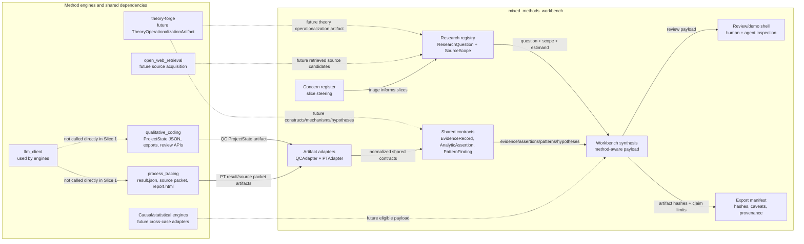
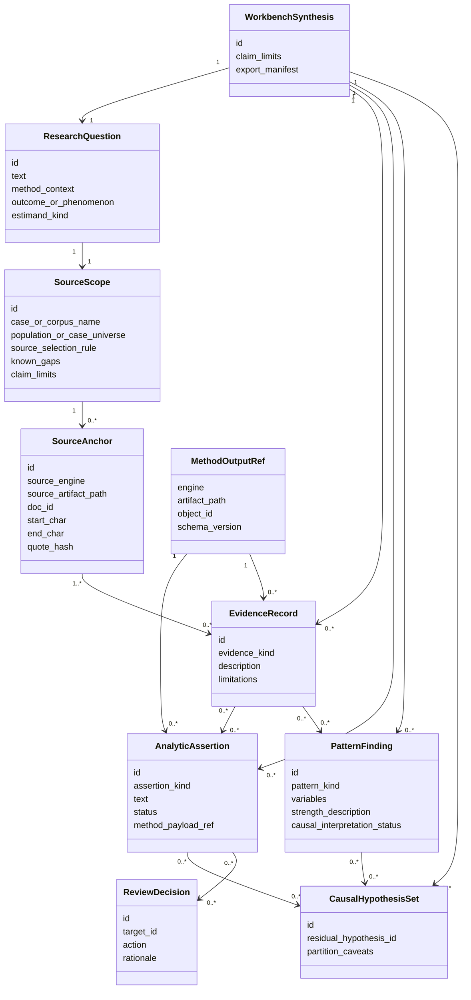
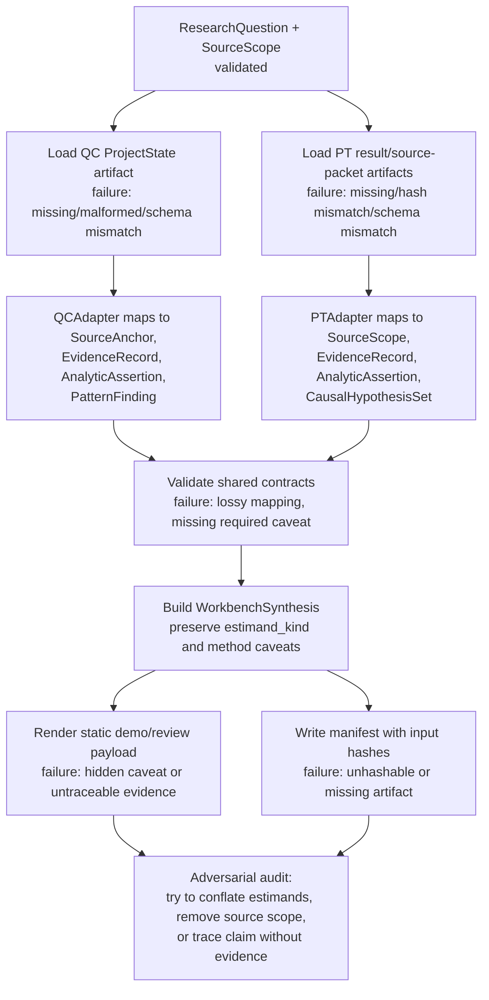

# Mixed Methods Workbench Architecture

Status: preliminary future architecture; documentation only
Updated: 2026-07-09

> Sequencing and full-scope authority now live in `docs/ROADMAP.md`,
> `docs/MIXED_METHODS_CAPABILITY_MAP.md`, and
> `docs/plans/003_integration_versioning_and_clean_state.md`. This document
> retains the narrower QC/PT walking-skeleton architecture. Its QC/PT result is
> multi-method qualitative research, not yet qualitative-quantitative mixed
> methods. It is not authorization to implement the design; current scope is in
> `docs/PLANNING_STATUS.md`.

This document applies the design-plan protocol to a future
`mixed_methods_workbench` that composes `qualitative_coding` and
`process_tracing` as method engines. `theory-forge` is tracked as a future
theory-operationalization artifact producer, not as a current runtime
dependency.

## 0. Frame

### Goals

The project goal is to build one research workbench that can ingest qualitative
and source evidence, run methodology-aware analysis engines, and produce
auditable PhD-level research artifacts.

At the workbench level, success means:

- a researcher can start from a bounded research question and corpus/source
  scope;
- the system can route work to qualitative coding, grounded-theory-inspired,
  process-tracing, and mixed-methods synthesis paths;
- every substantive output is backed by evidence records, source anchors,
  scope limits, review state, and export provenance;
- qualitative patterns can become candidate causal/abductive explanations
  without pretending descriptive association is causal proof;
- process-tracing comparative support can be shown alongside qualitative
  claims without conflating their estimands;
- future cross-case causal/statistical tooling can plug in through explicit
  eligibility contracts.
- future theory operationalizations can enter as explicit constructs,
  mechanisms, hypotheses, observables, assumptions, and scope conditions without
  pretending generated theory is validated evidence.

Failure means:

- the workbench becomes a dashboard over unrelated artifacts rather than a
  coherent research workflow;
- method outputs are flattened into one vague "confidence" score;
- evidence anchors, source scope, or claim limits are lost at engine boundaries;
- a repo merge is attempted before a stable contract proves what should merge.

### Constraints

- Keep `qualitative_coding` and `process_tracing` as independent method engines
  until a vertical slice proves a stronger integration boundary.
- Typed contracts at every durable cross-engine seam.
- File/artifact adapters first; direct library imports only after schemas and
  contract tests stabilize.
- Human review remains a first-class mode, but not the only source of rigor.
- Do not claim methodological validity or beyond-SOTA performance from the
  scaffold. This is architecture and planning only.
- Do not route the workbench through `theory-forge` AC backends. Theory Forge
  integration starts as an artifact dependency subplan.

### Borrow vs Build

| Capability | Decision | Rationale |
|---|---|---|
| Qualitative coding, claim ledger, QDA export | Borrow `qualitative_coding` | It already owns broad qualitative research state and review surfaces. |
| Process tracing, Bayesian support update | Borrow `process_tracing` | It already owns coherent causal inference contracts and deterministic math. |
| Theory operationalization | Borrow future `theory-forge` export | It owns paper -> theory schema/compile artifacts; the workbench should consume only a stable operationalization artifact. |
| Shared source/evidence/claim contracts | Build in workbench or future shared library | This is the integration seam and must be explicit. |
| Web retrieval | Borrow `open_web_retrieval` later | Retrieval is already shared infra; do not reimplement. |
| LLM calls | Borrow `llm_client` through engines | The workbench should not bypass engine-level observability. |
| Workbench shell/UI/API | Build locally | It must orchestrate method-specific artifacts and explain boundaries. |
| Formal cross-case causal estimation | Borrow established engines through adapters | Use tools like CausalQueries-style adapters behind eligibility gates. |

### ADRs

- `docs/adr/0001_method_engines_not_monorepo.md`
- `docs/adr/0002_broad_north_star_versioned_thin_slices.md`

### Clean Docs Note

The roadmap and detailed blueprint describe future sequencing. The planning
status document defines current authorized work. Existing engine repos remain
authoritative for their own local behavior and claim discipline.

## 1. Modality Split

| Surface | Mode | Treatment |
|---|---|---|
| Workbench boundaries and method-engine seams | Deductive | Specify component boundaries and typed contracts now. |
| Shared evidence/source/claim contracts | Deductive with narrow stubs | Define broad but truthful integration types; validate with fixtures. |
| QC/PT artifact adapter mappings | Hybrid | Field-level mappings are knowable; quote/anchor recovery behavior must be instrumented. |
| Theory Forge operationalization artifact | Dependency subplan | Define only a broad stub until one real green theory export exists. |
| Mixed-methods synthesis quality | Exploratory | Build readouts and review mockups before thresholds. |
| Causal/abductive model generation from qualitative patterns | Exploratory -> gated | Start with candidate generation/readout; promote stable model shapes later. |
| UI/workbench review experience | Hybrid | Static demo-mode mockup first; use real fixtures before live machinery. |
| Cross-case causal/statistical bridge | Dependency subplan | Define eligibility stub now; resolve engine and payload later. |

Do not fake precision on synthesis quality, causal model quality, or universal
PhD-level thresholds. These are ladder surfaces: instrument them, read off
failure modes, then promote stable contracts.

## 2. Requirements

### Functional Requirements

1. Register a research question, method context, corpus/source scope, and claim
   limits.
2. Import completed `qualitative_coding` project state artifacts.
3. Import completed `process_tracing` result/source-packet artifacts.
4. Normalize both engines into shared `SourceScope`, `SourceAnchor`,
   `EvidenceRecord`, `AnalyticAssertion`, `PatternFinding`, and
   `CausalHypothesisSet` contracts.
5. Render one workbench synthesis payload that preserves method-specific
   caveats and provenance.
6. Provide a review surface that lets a researcher inspect:
   evidence -> code/claim/pattern -> hypothesis/explanation -> report/export.
7. Export a manifest that records input artifact hashes and method-engine
   provenance.

### Non-Goals For The First Scaffold

- No live engine orchestration.
- No repo merge.
- No new LLM prompts.
- No live Theory Forge or AC backend orchestration.
- No causal effect estimation.
- No claim that the workbench already produces PhD-level research.

## 3. Boundary Diagram

Boundary decisions:

- The workbench reads artifacts first. It does not mutate engine state in the
  first slice.
- Method-engine internals remain outside the workbench boundary.
- Shared contracts are the first durable integration object.

## 4. Domain Model Diagram

## 5. Data Flow Diagram

Typed flow summary:

- `ResearchQuestion + SourceScope -> QCAdapter`
- `ResearchQuestion + SourceScope -> PTAdapter`
- `QC ProjectState artifact -> SharedContractBundle`
- `PT ProcessTracingResult artifact -> SharedContractBundle`
- `SharedContractBundle -> WorkbenchSynthesis`
- `WorkbenchSynthesis -> ReviewPayload`
- `WorkbenchSynthesis -> ExportManifest`

## 6. Backward Runtime Pass

### Final Runtime Payload

The first runtime payload is `WorkbenchSynthesis`: a single typed object that
can render a review/demo page and export a manifest while preserving method
boundaries.

### Producer

`WorkbenchSynthesizer` selects imported engine artifacts, validates their
schema/hash metadata, invokes adapters, merges the normalized contract bundle,
and applies caveat policies.

### Preconditions

- Research question and scope exist.
- At least one QC or PT artifact exists; Slice 1 requires both.
- Artifact hashes are computed.
- Adapter mappings produce no untyped payloads.
- Every assertion has either evidence references or an explicit
  `needs_anchor`/`source_gap` limitation.
- Every causal/process-tracing support object carries `estimand_kind`.

### Offline Compiler Outputs

Slice 1 should compile static fixture-backed JSON examples from already
completed local runs. These fixtures become the demo mode for the future UI.

## 7. Dependency-Resolution Subplans

### Dependency Subplan: QC Artifact Fixture

Blocks: Slice 1 adapter readout.

Known stub: Input is a `qualitative_coding` project state JSON. Output is a
partial `SharedContractBundle` with source anchors, evidence records, and
analytic assertions.

Unknowns:

- Which committed/demo QC artifact has the best combination of claims, anchors,
  negative cases, code relationships, and GT outputs.
- Whether all required source offsets survive export or must be loaded from the
  project store.

Instrument: inventory current QC demo/benchmark artifacts and run a tiny
adapter notebook or script that counts mappable claims, anchors, relationships,
and caveats.

Readout: one fixture produces at least one anchored evidence record, one
qualitative claim, one pattern/relationship, and one claim limit without manual
editing.

Promotion: update `contracts/shared_contracts.md` with exact QC mapping rules
and use that fixture in the Slice 1 demo payload.

### Dependency Subplan: PT Artifact Fixture

Blocks: Slice 1 adapter readout.

Known stub: Input is a `process_tracing` `result.json` plus optional source
packet. Output is a partial `SharedContractBundle` with source scope, evidence,
hypotheses, and comparative-support references.

Unknowns:

- Which local PT output should be regenerated as the canonical demo fixture.
- Whether evidence `source_text` can be reliably mapped to source anchors with
  offsets or must initially use source markers only.

Instrument: regenerate the public French Revolution/Directory case, run
`make audit-result`, then inspect evidence/source-packet fields for anchor
mapping.

Readout: one fixture produces at least one evidence record, one causal
hypothesis set, one source-scope caveat, and one comparative-support method
reference.

Promotion: update exact PT mapping rules and include the fixture in Slice 1.

### Dependency Subplan: Theory Forge Operationalization Artifact

Blocks: any theory-enhanced mixed-methods slice.

Known stub: Input is a future `theory-forge` export. Output is a workbench-safe
artifact containing constructs, mechanisms, hypotheses, observables, measures,
assumptions, scope conditions, uncertainties, validation obligations, and
compiled artifact references.

Unknowns:

- Whether the canonical producer is a v14 schema, v15 schema, compiled manifest,
  or new export composed from those.
- Which current theory is green enough to become the first fixture.
- How generated theory, theory operationalization, and compiled analysis code
  should map into the workbench domain model without becoming causal evidence.

Instrument: run the readiness subplan in
`docs/plans/002_engine_stability_and_integration_readiness.md`, pick one real
Theory Forge artifact, and draft a `TheoryOperationalizationArtifact` contract
from real fields.

Readout: one artifact validates and can be linked to workbench evidence and
hypothesis objects without importing Theory Forge internals or requiring any AC
runtime.

Promotion: update boundary/domain/data-flow diagrams and shared contracts before
starting a theory-enhanced workbench slice.

### Dependency Subplan: Mixed-Methods Synthesis Quality

Blocks: any claim that the workbench produces high-quality integrated research
output.

Known stub: Synthesis may report only structural completeness, traceability, and
method-boundary correctness.

Unknowns:

- What integrated output shape a human researcher actually finds useful.
- Which synthesis failures matter most: verbosity, shallow causal claims,
  evidence overload, missing caveats, or poor navigation.

Instrument: static HTML/Markdown mockup using real fixture data with review
prompts and empty/failure states.

Readout: reviewer can trace one finding from question -> source scope ->
evidence -> qualitative claim/pattern -> causal hypothesis/support -> caveat
without reading raw JSON.

Promotion: approved mockup becomes demo mode and informs API/UI contracts.

### Dependency Subplan: Cross-Case Causal Bridge

Blocks: future cross-case causal/statistical integration.

Known stub: `PatternFinding` can be marked `eligible_for_cross_case_model` only
after explicit eligibility checks.

Unknowns:

- Which engine(s) should own variable coding and estimand contracts.
- How QC matrices and PT within-case outputs should map into cross-case rows
  without mixing single-case support with population causal effects.

Instrument: one notebook over a tiny synthetic multi-case fixture that maps
code/category/pattern evidence into `CaseVariableCoding` rows and rejects
ineligible cases.

Readout: the notebook shows a valid eligible payload and at least two rejected
payloads with clear failure reasons.

Promotion: add `CrossCaseBridgePayload` to shared contracts and roadmap a
formal adapter.

## 8. Acceptance Criteria For The Planning Scaffold

- Frame, ADR, boundaries, domain model, data flow, dependency subplans, and
  concern register exist.
- The plan clearly says method engines stay separate for now.
- The first slice is vertical and fixture-backed.
- The plan distinguishes descriptive qualitative support, comparative
  process-tracing support, and population causal effects.
- Open exploratory surfaces have readouts rather than invented thresholds.
- Synthetic contract fixtures exist and validate with `make check`, while
  remaining explicitly marked as non-evidence scaffolding.

## 9. Failure Table

| Failure | Detection | Response |
|---|---|---|
| Estimand conflation | Review payload uses one generic confidence/support score. | Add `estimand_kind` and method-specific caveats; block export. |
| Lossy adapter | Source anchors or claim limits disappear after import. | Fail validation; update adapter or contract. |
| Dashboard-only shell | Review page cannot trace evidence to methods and caveats. | Rework mockup around research workflow path. |
| Premature repo merge | Work starts by moving engine code. | Stop and require a slice plan proving the boundary. |
| Fake quality threshold | Plan asserts PhD quality without a readout/validation path. | Move to concern register and define an exploratory instrument. |
| Synthetic fixture mistaken for readiness evidence | Fixture has no explicit status, grade, or claim limits. | Fail validation unless `artifact_status` and `C-synthetic-contract-only` grade are present. |
