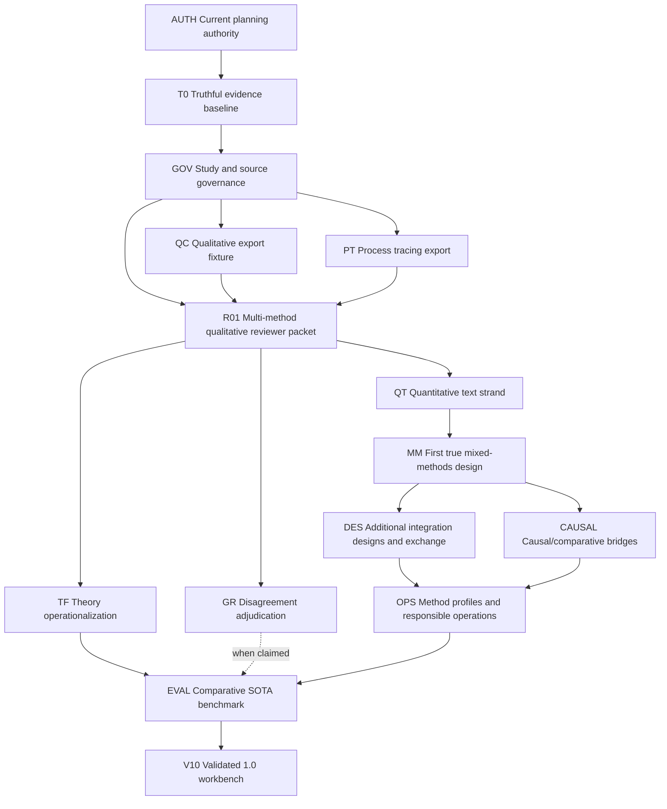

# Capability Dependency Graph

Status: canonical sequencing aid; documentation only, no release is active
Updated: 2026-07-12

## Purpose

This graph makes the broad roadmap executable as a dependency map without
authorizing implementation. It answers one question: what must be true before a
later capability can become central to the product?

Use this with:

- `docs/PLANNING_STATUS.md` for current authorization;
- `docs/ROADMAP.md` for the release ladder and critical path;
- `docs/PRE_IMPLEMENTATION_CHECKLIST.md` for the future entry gate after a
  named implementation authorization;
- `docs/MIXED_METHODS_CAPABILITY_MAP.md` for full methodological scope;
- `docs/plans/003_integration_versioning_and_clean_state.md` for detailed
  future 0.0 and 0.1 planning.

Rows below are not tasks. They are claim-licensing gates. A downstream row may
be planned, mocked, or sketched earlier, but it cannot become a release claim
until the rows it depends on have passed their verification artifacts.

## Dependency Shape



Critical path:

```text
AUTH -> T0 -> GOV -> QC + PT -> R01 -> QT -> MM -> OPS -> EVAL -> V10
```

`GR` and `TF` can progress in parallel after `R01`, but neither is a universal
prerequisite for `MM`; see ADR 0003. `QT` is the highest-risk missing owner
before the first true mixed-methods release. `DES` and `CAUSAL` may progress in
either order after `MM`, but both feed `OPS`. The current 1.0 profile declares
theory operationalization, so `TF` must join the evaluation path before `V10`.
`GR` joins that path only for releases that claim automated adjudication.

## Capability Table

| ID | Capability | Owner | Depends on | Current status | Current evidence | Success criteria | Verification artifact | Claim licensed |
|---|---|---|---|---|---|---|---|---|
| AUTH | Current planning authority | `mixed_methods_workbench` | none | documented | D, document review | Planning docs distinguish current facts, future proposals, and implementation authorization. | Documentation review plus `docs/PLANNING_STATUS.md`. | The current mode is documentation-only with no active implementation slice; completed T0-PROV is historical evidence. |
| T0 | Truthful evidence baseline | `mixed_methods_workbench` | AUTH | partial scaffold | F overall; W2 A for synthetic inventory provenance, fixture shapes C, remaining T0 criteria incomplete | Synthetic controls are discriminating, evidence grades are honest, and readiness gaps fail visibly. | `make check`, `make coverage`, coverage report, negative controls. | The repo has a truthful planning/fixture baseline, not live engine readiness. |
| GOV | Study and source governance baseline | Workbench plus producer exports | T0 | decision brief complete; blocked on case selection and named authorization | F overall; D source-backed options, no real source manifest | Protocol, corpus/source identity, source hashes, licensing/sensitivity caveats, and claim limits are present for the selected first case. | Future `ResearchBundle` manifest and source governance checks. | Workbench artifacts can be bounded to a governed source scope. |
| QC | Qualitative export fixture | `qualitative_coding` | T0, GOV | documented dependency | D, upstream plan only | One real export provides corpus denominator, anchors, codes/categories, claims, patterns, memos/review state, provenance, and claim limits without PT inference fields. | Engine-local strict export validation, pinned fixture, negative controls, producer commit. | QC can supply qualitative evidence and claims for one evaluated case. |
| PT | Process tracing export | `process_tracing` | T0, GOV | documented dependency | D, upstream plan only | One versioned export provides source packet identity, rival hypotheses, evidence/absence findings, comparative support, sensitivity, verdict language, caveats, and run metadata without internal coupling. | `pt_export_v1` fixture, tests, source packet hashes, producer commit. | PT can supply within-case comparative support for one evaluated case. |
| R01 | Multi-method qualitative reviewer packet | `mixed_methods_workbench` | QC, PT, GOV | future proposal | D, proposal only | A reviewer can trace question -> source scope -> QC claim/pattern -> PT hypothesis/support -> caveat over real pinned exports. | Static reviewer packet, contract tests, adversarial method-boundary review. | Version 0.1 may claim auditable multi-method qualitative review for one case. |
| GR | Disagreement adjudication | `grounded-research` plus workbench seam | R01 | planned dependency | D, planned seam only | Contested claims become a `ClaimDisputeBundle`; independent analyses, verification actions, disagreement types, and human dispositions return as `AdjudicationResult`. | Workbench case evaluation, human dispositions, seam tests. | The workbench can expose and disposition evidence disputes for evaluated cases. |
| TF | Theory operationalization | `theory-forge` plus workbench seam | R01 | planned dependency | D, planned seam only | One known-green export provides constructs, mechanisms, hypotheses, observables, measures, assumptions, scope conditions, uncertainties, validation obligations, and provenance. | Schema-validated `TheoryOperationalizationArtifact` from a real theory export. | Theory can guide and be challenged by analysis without being counted as empirical evidence. |
| QT | Quantitative text strand | Decision pending; recommended narrow `mixed_methods_workbench` adapter | R01, GOV, QC | decision brief complete; blocked on task/owner approval, case evidence, and exact construct | F, owner/task not approved; D source-backed options | A selected quantitative text task has a protocol, grouped held-out set, measurement or annotation instrument, transparent baselines, validation metrics, error analysis, uncertainty, and item-level links to qualitative constructs. | Adapter fixture, held-out evaluation, leakage controls, measurement/error report. | A quantitative text strand can be integrated for one named design. |
| MM | First true mixed-methods design | `mixed_methods_workbench` plus QT; GR/TF only when the named design uses them | R01, QT | blocked | F, no qual-quant integration evidence | Qualitative and quantitative strands are connected, built, merged, embedded, or transformed; joint display or equivalent, strand-relationship classification, contradiction disposition, and bounded meta-inference exist. | Exploratory-sequential review packet, integration controls, human/agent review. | Version 0.4 may claim one evaluated qualitative-quantitative mixed-methods design. |
| DES | Additional integration designs and exchange | Workbench | MM | skeleton | F overall; D roadmap only | Convergent, explanatory sequential, and embedded designs each have explicit timing, priority, integration operations, and exchange/export obligations. | Design-specific fixtures, REFI-QDA/tabular export tests, reporting-profile checks. | The product supports multiple named integration designs without flattening them. |
| CAUSAL | Causal/comparative bridges | Workbench plus PT and quantitative adapters | MM | skeleton | F overall; D roadmap only | Nested analysis, QCA/fsQCA, text-as-treatment/mediator/outcome/confounder, and cross-case bridges declare estimands, identification assumptions, measurement error, and scope. | Eligibility notebooks, adapter fixtures, causal assumption checks, rejected-case controls. | The product can bridge within-case and cross-case analysis with explicit limits. |
| OPS | Method profiles and responsible operations | Workbench plus producers | DES, CAUSAL | skeleton | F overall; D scope inventory only | Method profiles declare valid operations, evidence obligations, forbidden claims, reporting requirements, governance, roles, privacy, translation, retention, drift, and API parity. | Profile tests, governance metadata checks, review queues, export bundle validation. | Broader method support is profile-specific rather than a universal quality score. |
| EVAL | Comparative SOTA benchmark | Workbench plus independent reviewers | OPS, TF for the current V10 profile; GR only if claimed | absent | F, no benchmark | Multiple domains, languages, source genres, held-out cases, planted failures, negative controls, trace evaluation, expert rubrics, incumbent baselines, ablations, labor/time/cost, and drift checks are observed. | Frozen benchmark package, expert review records, trace-eval results, ablation report. | Bounded SOTA or beyond-SOTA claims are evidence-backed for named tasks and domains. |
| V10 | Validated 1.0 workbench | Workbench release bundle | EVAL | future | F, depends on unbuilt gates | Goals G1-G6 in `docs/ROADMAP.md` meet their 1.0 conditions for named designs and domains, with unsupported methods documented. | Release bundle, compatibility manifest, benchmark results, known-limits report. | The project can claim a validated text-centered mixed-methods workbench for the supported scope. |

## Decision Gates

Before future implementation starts, the selected slice must name which row it
advances and confirm that its dependencies still hold. The first required gate
is always the fresh state review in `docs/PRE_IMPLEMENTATION_CHECKLIST.md`.

Known stop points:

- `QT`: approve the task/owner pattern, then select the exact case-supported
  construct after its feasibility readout and before 0.4.
- `R01`: select bounded FRUS or require a rights-clean Brumaire rebuild before
  replacing invented fixtures. The decision brief recommendation is not GOV
  authorization.
- `GR`: evaluate Grounded Research on workbench claims rather than inheriting a
  general validity claim from its own benchmarks; require it only when the
  selected release claims automated adjudication.
- `TF`: select one known-green Theory Forge export before designing a hard
  workbench schema. It does not block the first `MM` case, but it does block the
  current V10 profile's theory-operationalization claim.
- `research_v3`: keep off the critical path until its active-versus-archived
  role is resolved by ADR.
- `EVAL`: refresh external SOTA and incumbent baselines at benchmark design
  time, not from stale planning citations.

## Sources Consulted

> Sources: `README.md`; `PROJECT.md`; `CLAUDE.md`;
> `docs/PLANNING_STATUS.md`; `docs/ROADMAP.md`;
> `docs/decisions/2026-07-12-first-governed-case.md`;
> `docs/decisions/2026-07-12-first-quantitative-text-strand.md`;
> `docs/PRE_IMPLEMENTATION_CHECKLIST.md`;
> `docs/MIXED_METHODS_CAPABILITY_MAP.md`; `docs/CONCERNS.md`;
> `docs/ARCHITECTURE.md`; `docs/IMPLEMENTING_AGENT_NOTES.md`;
> `docs/coverage_report.md`; `docs/wiki_manifest.yaml`;
> `docs/adr/0001_method_engines_not_monorepo.md`;
> `docs/adr/0002_broad_north_star_versioned_thin_slices.md`;
> `docs/adr/0003_mixed_methods_minimum_and_optional_enhancers.md`;
> `docs/plans/001_walking_skeleton.md`;
> `docs/plans/002_engine_stability_and_integration_readiness.md`;
> `docs/plans/003_integration_versioning_and_clean_state.md`;
> `contracts/shared_contracts.md`;
> `examples/integration_payload_mockup.md`;
> `examples/fixtures/workbench_contract_v1/README.md`.
>
> Not consulted: JSON fixture files and generated JSON coverage, because they
> are machine-readable scaffold evidence rather than planning-authority text.
> `~/projects/investigations/mixed_methods_workbench/2026-07-12-sota-program-baseline.md` and
> `docs/SOTA_EVIDENCE_SCORECARD.md` provide the 2026-07-12 external refresh.
> The benchmark row still requires another refresh before any SOTA decision or
> public claim.
