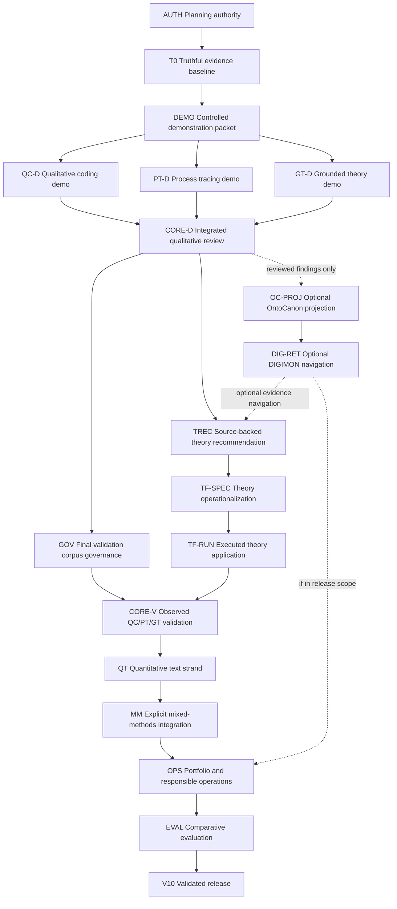

# Capability Dependency Graph

Status: canonical sequencing aid; documentation only, no release is active
Updated: 2026-07-12

## Purpose

This graph says what must be demonstrated before a later product claim is
allowed. It does not authorize implementation. ADR 0004 governs the demo-first
order; `docs/PLANNING_STATUS.md` governs current authority.

## Dependency Shape



Critical path for the planned full product profile:

```text
AUTH -> T0 -> DEMO -> QC-D + PT-D + GT-D -> CORE-D
-> TREC -> TF-SPEC -> TF-RUN -> GOV -> CORE-V -> QT -> MM -> OPS -> EVAL -> V10
```

`OC-PROJ` and `DIG-RET` are reusable infrastructure branches, not method
prerequisites. A smaller genuine mixed-methods claim can omit Theory Forge if
its named study does not claim theory recommendation/operationalization; the
current full product sequence includes it. Final corpus research can occur in
parallel, but `GOV` blocks observed empirical claims, not the controlled demo.

## Capability Table

| ID | Capability and owner | Depends on | Evidence now | Pass condition | Claim licensed |
|---|---|---|---|---|---|
| AUTH | Planning authority; workbench | none | D | Current facts, plans, and authorization are distinct. | Planning may proceed; implementation is still separately named. |
| T0 | Truthful evidence baseline; workbench | AUTH | F overall; W2 A, fixture shapes C | Controls discriminate, grades are honest, and unsupported readiness fails loudly. | The scaffold reports its evidence truthfully. |
| DEMO | Controlled demo packet; workbench | T0 | F | Small synthetic or rights-clear sources, expected method signals, source anchors, and software-only claim limits are fixed. | Software behavior can be demonstrated, not empirical validity. |
| QC-D | Qualitative coding lane; `qualitative_coding` | DEMO | D | Native export preserves denominator, anchors, codes/categories, claims, memos, review, provenance, and limits. | QC workflow is inspectable on the demo. |
| PT-D | Process tracing lane; `process_tracing` | DEMO | D | Native export preserves rivals, evidence/absence findings, diagnosticity, sensitivity, verdict language, provenance, and limits. | PT workflow is inspectable on the demo. |
| GT-D | Grounded-theory-inspired lane; `qualitative_coding` | DEMO | D; producer substrate implemented, full-GT gates missing | Constant comparison, memos, category development, negative cases, sampling suggestions/decisions, and adequacy limits are traceable without claiming saturation. | GT-inspired workflow is inspectable on the demo; this is not full GT or `grounded-research`. |
| CORE-D | Integrated qualitative review; workbench | QC-D, PT-D, GT-D | F | One packet compares method-specific findings without converting them to a generic score and steps down to sources. | The method core is demonstrably useful. |
| OC-PROJ | Governed assertion projection; OntoCanon + adapter | CORE-D | D, reviewed implementation evidence external to repo | Only selected reviewed findings project to versioned, source-bound assertions; round-trip references preserve native authority. | Shared governed identity/linkage is available. |
| DIG-RET | Graph/evidence navigation; DIGIMON + adapter | OC-PROJ | D, bounded mainline provider observed externally | Retrieval and graph views cite governed passages and native findings; exact supported commit/contract is pinned. | Optional cross-document navigation is available. |
| TREC | Theory recommendation; workbench/research services | CORE-D; DIG-RET optional | F | Curated library and academic search return cited candidates; LLM recall only produces leads; human selection and rejection rationale are recorded. | A source-backed theory shortlist can guide analysis. |
| TF-SPEC | Theory operationalization; Theory Forge | TREC | D, producer plan only | A selected theory yields a strict frozen schema/manifest artifact with constructs, mechanisms, scope, assumptions, uncertainty, and validation obligations. | The selected theory's analytic contract is inspectable. |
| TF-RUN | Executed theory application; Theory Forge | TF-SPEC | F, seam not designed | A versioned run export preserves inputs, source hashes, compiled stages, typed outputs, failures, anchors, model/prompt versions, uncertainty, and limits. | A staged Theory Forge application can be reviewed without live coupling. |
| GOV | Final validation corpus governance; workbench + producers | CORE-D | D options; selection deferred | Protocol, rights, scope, denominator, hashes, sensitivity, and claim limits are approved for a selected corpus. | Observed analysis may be bounded to a real source universe. |
| CORE-V | Observed core-method validation; workbench + QC/PT/GT | GOV, TF-RUN for full profile | F | Real QC/PT/GT runs pass method-specific evaluation and a reviewer can trace disagreements and theory challenges. | The core works on an evaluated real case. |
| QT | Quantitative text strand; owner unresolved | CORE-V | F; D decision options | Named construct, instrument, held-out grouping, baselines, uncertainty, leakage controls, and error analysis pass. | A quantitative strand is ready to integrate. |
| MM | Genuine mixed-methods design; workbench | CORE-V, QT | F | A named connecting/building/merging/embedding operation, joint display, divergence handling, and bounded meta-inference exist. | One evaluated qualitative-quantitative mixed-methods design exists. |
| OPS | Portfolio/interchange/governance; workbench + producers | MM | F | Method profiles, roles, privacy, exports, API parity, drift, and reproducible bundles pass. | Supported scope is operationally responsible and agent-drivable. |
| EVAL | Comparative evaluation; independent reviewers | OPS | F | Frozen cases, incumbents, human/simple baselines, traces, ablations, uncertainty, and independent sign-off pass. | Bounded SOTA claims may be made for named tasks/domains. |
| V10 | Validated release; workbench | EVAL | F | Every declared capability has current evidence, limits, replay, and clean-room reproduction. | A bounded validated workbench release exists. |

## Human Decision Gates

- Authorize a named `DEMO` planning/implementation slice before any code.
- Approve `qualitative_coding` as the GT-I producer and keep the lane
  `grounded-theory-inspired` until populated theoretical-sampling and D8 expert
  evidence license a stronger claim.
- Pin an OntoCanon/DIGIMON contract and released commit before depending on
  those optional branches; do not target an unmerged DIGIMON worktree.
- Approve theory-library inclusion rules, academic-search sources, and the
  human selection record before `TREC`.
- Theory Forge must own both export seams; the workbench must not infer them
  from internal dataclasses.
- Select the final corpus at `GOV`, using demo evidence to judge fit. FRUS is a
  retained candidate, not a preselected answer.
- Approve the quantitative construct and owner only after real core-method
  findings show what is worth measuring.

## Sources Consulted

See the complete synthesis ledger in ADR 0004. The dependency shape also uses
the current roadmap, capability map, concern register, producer-readiness
research, and the 2026-07-12 Theory Forge and OntoCanon/DIGIMON investigations.
