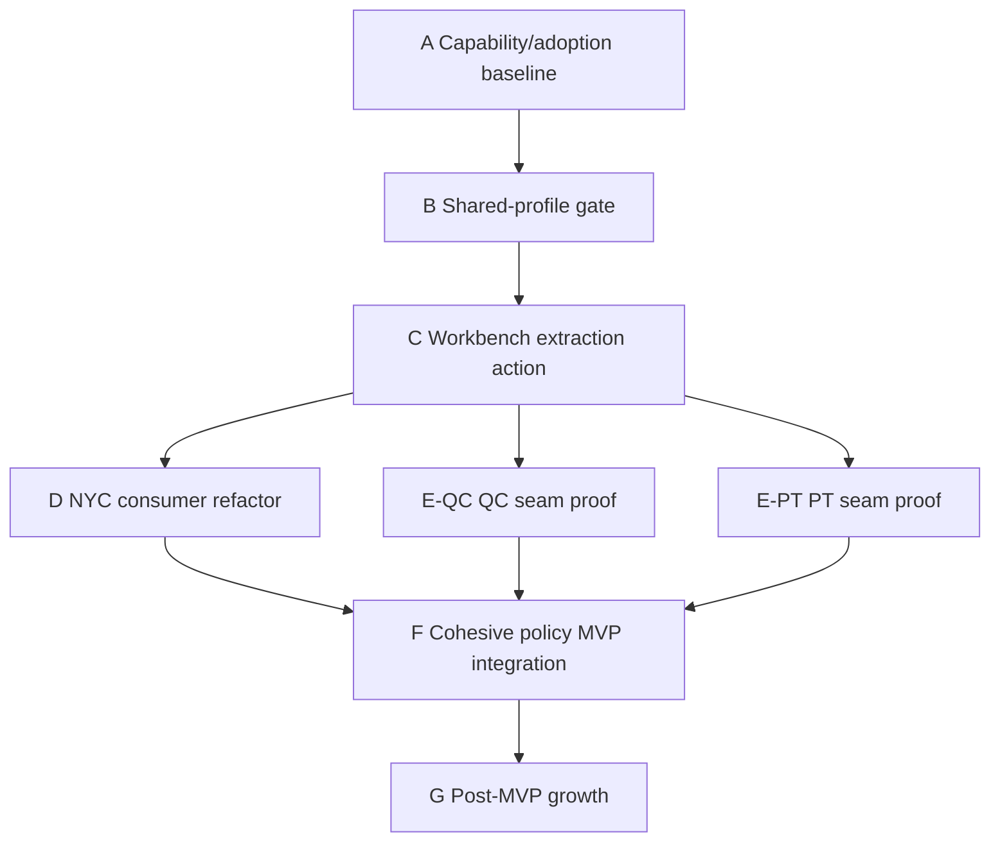
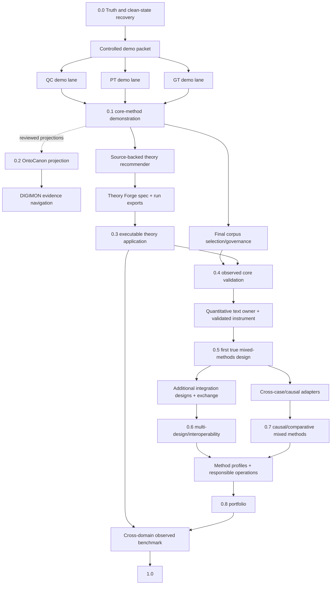

# Mixed Methods Workbench Roadmap

Status: canonical future strategy; documentation only, no release is active
Updated: 2026-08-13; phase order amended 2026-09-06

## Current Phase

The project is establishing the capability architecture and adoption baseline
before another implementation vertical. This roadmap does not authorize
implementation; `docs/PLANNING_STATUS.md` is authoritative about what work is
allowed now.

The controlling system description is
[`SYSTEM_GOAL_AND_CAPABILITY_ARCHITECTURE.md`](SYSTEM_GOAL_AND_CAPABILITY_ARCHITECTURE.md).
The current owner/seam/adoption evidence is
[`CAPABILITY_ADOPTION_MAP.md`](CAPABILITY_ADOPTION_MAP.md). The older broad
capability map and version ladder remain goal coverage and historical strategy;
they do not override the adopted infrastructure-first MVP sequence below.

## North Star

Build the most rigorous and agent-drivable environment for text-centered
mixed-methods research: one place where a researcher can design a study, govern
its source corpus, conduct methodologically faithful qualitative and
quantitative analyses, test causal and theoretical explanations, integrate
strands explicitly, resolve disagreement, and export a reproducible chain from
source to meta-inference.

The scope is intentionally broad. The execution strategy is not. Each release
delivers one thin, real, inspectable research path and expands the number of
method designs that the workbench can support deeply.

The stable example remains the NYC Congestion Relief Zone investigation, but
the example follows the capability architecture. It does not define shared
primitives through case-specific code.

## What `1.0` Means

Version 1.0 does **not** mean that every research tradition is automated. It
means that the workbench provides:

- a governed study/corpus foundation;
- a method-profile system that prevents one tradition's validity rules from
  being imposed on another;
- at least one validated qualitative analysis path;
- at least one validated computational/quantitative text path;
- within-case causal reasoning and theory operationalization without category
  errors;
- at least one genuine qualitative-quantitative integration design with a joint
  display and meta-inference;
- human review, reflexivity, provenance, reporting, and interoperable exports;
- an observed benchmark showing what works, where it fails, and which claims
  remain bounded.

Breadth after 1.0 comes from adding validated method profiles and integration
designs, not from adding generic buttons.

## Goal Map

| Goal | Researcher-visible outcome | Current evidence | 1.0 condition |
|---|---|---|---|
| G1. Trustworthy evidence from text | Every claim traces to governed sources, anchors, transformations, and review decisions. | W2 A for inventory provenance; synthetic shapes C; broader T0 F | Observed real projects with adversarial provenance failures caught. |
| G2. Methodologically faithful qualitative analysis | Researchers can use appropriate coding, comparison, memoing, negative-case, and theory-building workflows. | Upstream implementation exists; workbench integration is D | One validated path plus extensible method profiles. |
| G3. Causal and theoretical reasoning without conflation | Rival explanations, mechanisms, observables, and theory context remain distinguishable from empirical evidence and effects. | PT implemented but export planned; TF export planned | PT and theory artifacts integrated with method-specific inference semantics. |
| G4. Genuine mixed-methods integration | Qualitative and quantitative strands are connected, built, merged, or embedded into reviewable meta-inferences. | F | One observed design, joint display, contradiction disposition, and integration-quality review. |
| G5. Reproducible collaborative research | Humans and agents can inspect, rerun, adjudicate, and export the same study. | D | Versioned research bundle, roles/decisions, reporting profiles, and exchange formats. |
| G6. Demonstrated SOTA or beyond-SOTA value | The system is faster or more rigorous on named tasks without hiding methodological failures. | F | Multi-domain benchmark with expert review, held-out cases, negative controls, and trace evaluation. |

The detailed capability inventory and ownership map is in
`docs/MIXED_METHODS_CAPABILITY_MAP.md`; its current executable-seam and adoption
dispositions are in `docs/CAPABILITY_ADOPTION_MAP.md`. The claim-licensing
dependency table that states what each capability must prove before becoming a
product claim is in `docs/CAPABILITY_DEPENDENCY_GRAPH.md`. The active long-term
goal and current external comparison baseline are in
`plan/goals/2026-07-12-sota-or-beyond.md` and
`docs/SOTA_EVIDENCE_SCORECARD.md`.

## Adopted execution roadmap to the authentic MVP

### A. Existing-capability and adoption baseline

Inventory the real owners at exact revisions. Separate internal code, stable
typed boundaries, intended-consumer adoption, and authentic runtime evidence.
Use `reuse`, `wrap`, `extend`, `supersede`, `keep_method_owned`, `defer`,
`explicit_exception`, or `missing` for every MVP-relevant capability.

Critical result: the Workbench knows what it can compose without rebuilding
Data Contracts, `llm_client`, Open Web Retrieval, QC, Process Tracing, Theory
Forge, Grounded Research, OntoCanon, DIGIMON, or a quantitative/simulation
owner.

### B. Layered architecture and shared-profile gate

Map observed operations to generic execution forms, reusable research
primitives, method-owned protocols, and study workflows. Preserve authority,
information origin, exact evidence, prespecification barriers, reflexivity,
feedback versions, and claim limits.

Freeze a Project Meta-owned method-operation composition and
evidence-round-trip profile subordinate to the existing shared artifact and
composition architecture. The Workbench consumes that profile; it does not
create a second ecosystem control plane.

### C. First reusable semantic capability

Adopt a narrow `ExtractStructuredCandidates` action composed from Data
Contracts and `llm_client`. Method owners supply versioned output contracts,
instructions, validators, and interpretation. The Workbench supplies source
bindings, adapter resolution, investigation state, application-level review
orchestration, integration acceptance, and value/publication decisions.
Method owners retain authoritative method review, and OntoCanon retains any
separate assertion-candidate review and promotion.

The action produces candidates and receipts, never accepted evidence by
itself.

### D. Refactor the authentic NYC consumer

Move the existing frozen NYC extraction through the shared action. Preserve
the authentic model trace, rejected attempts, exact source anchors, and pending
review state. Require a focused check that rejects bypass of the selected
action. Do not accept or rewrite the pending substantive statements merely to
complete the refactor.

### E. Method-protocol seam proof

Adapt one QC move and one Process Tracing move that share semantic transform
plus deterministic validation but retain different candidate universes,
method state, admissibility rules, reviewers, transitions, and conclusion
limits. This proves composable machinery without declaring the methods
equivalent.

### F. Cohesive policy MVP

Continue the existing NYC investigation through reviewed extraction,
method-owned qualitative analysis, deterministic quantitative work, an
explicit mixed-methods integration design, value-explicit policy appraisal,
limitations, and reproducible export. Add Theory Forge, Process Tracing,
OntoCanon, DIGIMON, simulation, or another method only when the study question
requires it.

### G. Growth after MVP

Add methodology guidance, more study designs, optional governed graph
navigation, broader quantitative methods, interoperability, and comparative
evaluation only after the lower layers have authentic consumers.

**Order change, 2026-09-06.** Brian approved Path A of the 2026-09-06
assessment (`docs/runs/2026-09-06-state-assessment-and-next-agent-brief.md`): finish the NYC
vertical first — `NYC-QC-1` on the existing `qualitative_coding` lane, then
`NYC-INTEGRATE-1` and `NYC-MVP-REVIEW-1` — and enter Phases C and D afterwards
with two real consumers (the workbench extraction and QC's Describe export).
The paragraph that follows is retained as the 2026-08-13 wording it replaces.

> This sequence supersedes a direct jump from the current NYC review gate to
> another case-specific `NYC-QC-1` or `NYC-INTEGRATE-1` implementation. It
> preserves Plan #5 evidence and resumes its substantive workflow after the
> reusable seam is adopted.

### Parallel execution shape



Phase A is read-only portfolio discovery and may run in parallel by repository.
Phase B has one coordinating writer because it owns a shared decision surface,
with independent reviewers. After Phase C freezes the action contract, the NYC,
QC, and PT consumer lanes may run in parallel in separate claimed worktrees and
owner repositories. They must not edit the shared action contract independently.
Phase F is a single Workbench integration lane over accepted inputs. Optional
OntoCanon/DIGIMON, theory, simulation, or quantitative-engine lanes join only
when the accepted study design makes them dependencies.

Do not issue a machine-consumed work-unit graph for C-F until the Phase B
profile and Phase C design are adopted. Before then, precise file ownership and
unit readiness would be invented rather than coordinated.

## Version Ladder

The version ladder below remains a long-range capability and claim ladder. Its
historical numbering is not the current execution order where it conflicts
with the adopted A-G sequence above.

### 0.0 — Truth and Clean-State Recovery

Purpose: make repository status and evidence claims trustworthy before further
integration work.

Thin slice:

```text
synthetic contract -> intended invariant-specific negative control
-> honest coverage report -> ecosystem readiness manifest
```

Required outcomes:

- repair the fixture validator and controls so each mutation reaches the
  intended invariant;
- replace false A grades with honest evidence grades;
- separate theory context from empirical evidence in contracts;
- permit method-scoped PT comparative support while rejecting it in QC;
- establish repository and export clean-state gates;
- reconcile canonical plan, status, and concern surfaces.

Release claim: the project has a truthful planning and verification baseline.
It does not have live engine integration.

### 0.1 — Controlled Core-Method Demonstration

Purpose: prove the workbench workflow before asking a final empirical corpus
to carry product risk.

Thin slice:

```text
small synthetic/rights-clear packet
-> separate QC + PT + grounded-theory native outputs
-> method-aware comparison -> source-to-caveat reviewer packet
```

QC discovers and anchors patterns; PT compares rival within-case explanations;
GT uses constant comparison, memoing, category development, theoretical
sampling decisions, and an explicit adequacy/saturation argument. GT is not
the `grounded-research` project. The three outputs remain distinct and no
generic confidence score combines them.

Release claim: the software can demonstrate an inspectable multi-method
qualitative workflow. Synthetic/open demonstration evidence does not establish
method validity or an empirical finding.

### 0.2 — Governed Knowledge and Evidence Navigation

Purpose: reuse shared knowledge infrastructure without making it the authority
for method inference.

Thin slice:

```text
reviewed method-native findings -> optional OntoCanon assertion projection
-> DIGIMON graph/evidence navigation -> original source and native artifact
```

OntoCanon owns governed assertions, ontology packs, identity, provenance,
review/promotion, and exports. DIGIMON owns graph/index projections, retrieval,
ranking, and analytics. Both are optional: QC/PT/GT lanes must remain useful
without a graph, and every projection retains a round trip to its native source
of truth. Target only a pinned, supported DIGIMON contract—not an unmerged
branch.

Release claim: reviewed findings can be linked and navigated through governed
knowledge infrastructure without flattening their method semantics.

### 0.3 — Theory Recommendation and Executable Theory Application

Purpose: help a researcher find, select, formalize, compile, run, and challenge
relevant theory after the core methods have demonstrated useful signals.

Thin slice:

```text
method findings -> curated theory library + academic search
-> cited candidate shortlist -> human selection
-> Theory Forge schema -> compiled theory-specific pipeline
-> staged run -> grounded review and challenge
```

LLM knowledge may propose search leads but cannot create an uncited theory
record. Theory Forge is a compile-and-run engine, not a mechanism/observable
form. The workbench consumes a frozen `TheoryOperationalizationArtifact` and a
future typed `TheoryApplicationRun`; it does not call compiler internals.

Release claim: a human-approved theory can guide a traceable staged analysis
and be challenged by empirical work. Neither the theory schema nor generated
run is itself empirical support.

### 0.4 — Governed Real-Core Validation

Purpose: choose the final corpus using lessons from the demonstration, then
test QC, PT, and GT on a rights- and scope-governed real source universe.

The existing FRUS Cuban Missile Crisis recommendation remains a later
validation candidate. It is not selected by this roadmap. Corpus identity,
denominator, rights, hashes, sensitivity, study protocol, and claim limits must
pass before observed runs begin.

Release claim: the qualitative method core works on one evaluated real case
with method-specific review. It is still not qualitative-quantitative mixed
methods.

`grounded-research` adjudication may join here through a typed contested-claim
seam when that capability is explicitly claimed; it is not GT and is not a
universal truth oracle.

### 0.5 — First Genuine Mixed-Methods Design

Purpose: cross the methodological boundary from multiple qualitative methods to
intentional qualitative-quantitative integration.

Recommended first design: begin with an **exploratory sequential** design. Use
qualitative categories and anchored examples to define a quantitative coding or
measurement instrument; apply and validate it on a held-out text set; merge the
results in a joint display; and write bounded meta-inferences with explicit
divergence handling.

Thin slice:

```text
qualitative construct discovery -> reviewed measurement specification
-> held-out quantitative text annotation/measurement -> joint display
-> convergence/divergence review -> meta-inference
```

Current decision recommendation: estimate the prevalence or ordered
distribution of one observable, case-supported QC category. Require a
transparent dictionary/count and regularized supervised comparison; choose the
primary instrument only after a grouped, leakage-safe feasibility readout; and
keep topic/embedding output out of the first measure. The first adapter should
be narrow and workbench-owned around established libraries. Extract a shared
engine only after at least a second real slice reveals a stable interface.
Brian must approve the task/owner pattern and later the exact construct. See
`docs/decisions/2026-07-12-first-quantitative-text-strand.md`.

Minimum claim dependencies are the observed `CORE-V` method core plus the
governed `QT` strand. Grounded Research is required only if the named study
claims automated adjudication. Theory Forge is in the planned full-product
sequence but is not constitutive of mixed methods; see ADRs 0003 and 0004.

Release claim: one evaluated exploratory-sequential mixed-methods design exists.
No causal-effect claim is licensed without a separate identification design.

### 0.6 — Multiple Integration Designs and Interoperability

Purpose: expand from one design to a small portfolio without losing depth.

Add, in risk order:

1. convergent design with independent strand analysis and explicit
   convergence/complementarity/divergence/silence review;
2. explanatory sequential design where quantitative results determine
   qualitative follow-up sampling;
3. embedded design where one strand answers a bounded secondary question;
4. REFI-QDA project/codebook exchange and reproducible tabular/statistical
   exchange;
5. reporting profiles for JARS mixed methods, SRQR/COREQ, and MMAT appraisal.

Release claim: researchers can choose among several explicit integration
designs and exchange work with established research software.

### 0.7 — Causal and Comparative Mixed Methods

Purpose: bridge within-case evidence to cross-case analysis without pretending
that one substitutes for the other.

Thin slices:

- nested analysis: cross-case pattern selects cases, PT investigates mechanism;
- PT results constrain or explain a quantitative model;
- QCA/fsQCA eligibility and truth-table bridge;
- text-as-treatment, mediator, outcome, or confounder designs with declared
  identification assumptions;
- cross-case temporal, event, relational, and network analysis.

Release claim: named causal/comparative designs are supported with explicit
estimands, case-selection logic, measurement error, and identification limits.

### 0.8 — Method Portfolio and Responsible Research Operations

Purpose: broaden qualitative and text-analytic coverage through versioned method
profiles and harden the product for real research teams.

Candidate profiles: reflexive thematic analysis, codebook thematic/content
analysis, grounded theory, framework analysis, narrative analysis, discourse
analysis, conversation analysis, phenomenology/IPA, ethnography, case/document
analysis, qualitative evidence synthesis, supervised text classification,
dictionary analysis, topic/cluster models, semantic scaling, and multilingual
analysis.

Cross-cutting operations: consent/IRB metadata, licensing, de-identification,
access control, translation provenance, collaboration roles, reflexivity,
model/prompt drift, audit retention, and reproducible export bundles.

Release claim: a broader set of traditions is supported through explicit,
method-specific obligations rather than a universal quality score.

### 0.9 — SOTA Evaluation and Product Hardening

Purpose: determine where the integrated system is actually competitive and
where human or methodological limits remain.

Required evaluation dimensions:

- multiple domains, languages, source genres, and study designs;
- frozen source packets, held-out cases, planted failures, and negative
  controls;
- expert rubrics and disagreement, not a fictional universal human ground
  truth;
- task quality, methodological fidelity, calibration, reproducibility, labor,
  time, and real observed cost;
- full multi-stage traces, corruption checks, and model/version drift;
- incumbent workflow baselines and ablations for each engine/integration step.

Release claim: bounded SOTA claims supported by observed comparative evidence.

### 1.0 — Validated Text-Centered Mixed-Methods Workbench

Purpose: promote the capability ladder into a coherent research product.

Gate: G1–G6 meet their 1.0 conditions for named designs and domains; the release
bundle documents unsupported methods and known limits just as prominently as
supported paths.

### 2.x — Beyond-SOTA Adaptive Research System

The post-1.0 frontier is not “more autonomous prose.” It is a closed-loop,
methodologically governed research system:

- contradiction-seeking and disagreement-first agent ensembles;
- active learning, theoretical sampling, case selection, and source design;
- automatic proposal of the next most discriminating source or analysis;
- dynamic calibration and drift detection by method/profile;
- cross-method provenance graphs and counterfactual audit of meta-inferences;
- reusable, third-party method profiles and engine adapters;
- programmatic exhaustive coverage, agent judgment, and explicit human
  direction at the decisions each actor handles best.

## Dependency Graph and Critical Path

This section is the high-level release graph. The full capability table with
owner, dependency, success criteria, verification artifact, and claim licensed
is `docs/CAPABILITY_DEPENDENCY_GRAPH.md`.



The full-profile critical path is `0.0 -> controlled demo -> QC + PT + GT ->
0.1 -> theory recommender -> Theory Forge spec + run -> final corpus governance
-> 0.4 -> quantitative text -> 0.5 -> portfolio/evaluation -> 1.0`.
OntoCanon/DIGIMON are optional infrastructure branches. A smaller mixed-methods
claim can omit Theory Forge when it makes no theory capability claim, but the
planned full profile includes it. Grounded Research joins only when automated
adjudication is claimed.

`research_v3` is not on the critical path. Its current docs disagree about
whether it is active or archived. Until an ADR resolves that conflict, treat it
as an experimental deep-investigation artifact producer; use
`open_web_retrieval` for shared retrieval and Grounded Research for adjudication.

## Versioning and Compatibility Rules

Product versions and artifact schema versions are independent. Every durable
artifact carries:

- `schema_id` and semantic `schema_version`;
- producer repository and commit;
- run/trace identifier;
- source and input artifact hashes;
- configuration, prompt, model, and method-profile versions where applicable;
- creation time and validation result;
- claim limits and known unsupported semantics.

Schema rules:

- major: incompatible meaning, removed/renamed required field, or changed
  invariant;
- minor: backward-compatible optional capability;
- patch: clarification or bug repair that does not change valid payload meaning.

Producers validate strict exports. Workbench consumers accept compatible minor
extensions but fail on an unsupported major version or an unknown critical
capability. The workbench owns adapters and a compatibility matrix. Only the
small common envelope should move to `data_contracts`; method payloads remain
owned by their engines until repeated real slices prove they are shared.

## Clean-State Definition

An engine is “ready to integrate” only when all of the following are recorded in
a machine-readable ecosystem manifest:

- canonical repo/branch/commit and clean worktree state;
- no unexplained untracked files or stale conflicting status docs;
- discoverable `make help` and deterministic check, lint, and type commands;
- versioned strict producer schema and a real fixture;
- exact source command, input hashes, producer commit, and validation result;
- honest evidence grade and at least one invariant-specific negative control;
- open concerns, claim limits, and compatibility range;
- no dependency on engine internals, local absolute paths, or unrecoverable
  state.

A green command is not enough. The negative control must be shown to fail for
the intended reason after unrelated gates such as integrity hashes are kept
neutral.

## Sequencing Rules

1. Complete 0.0 before upstream integration code.
2. Stabilize exports in the owning engine repositories; do not reverse-engineer
   internal state in the workbench.
3. Finish the complete end-to-end slice for one public case before adding a
   second method or case.
4. Advance evidence grades in order: doc -> fixture -> schema validated -> test
   -> observed.
5. Keep exploratory quality surfaces instrumented until readouts justify a
   stable gate.
6. Do not let a later version block verification and cleanup of an earlier one.
7. Do not call any version mixed methods without an explicit qualitative-
   quantitative integration operation and meta-inference.

## Future Implementation Entry Point

Brian's 2026-07-12 instruction narrowly authorized the handoff's named
`T0-PROV` provenance-inventory subcriterion (coverage row W2). It is completed
and independently signed off at A/test for inventory provenance only; it did
not close T0/0.0. Its completed evidence plan is
`docs/plans/current_t0_truthful_fixture_inventory.md`. No implementation slice
is active; remaining 0.0 work, producer changes, 0.1 integration, and later
rows are not activated.

For later authorization, the detailed starting blueprint is
`docs/plans/003_integration_versioning_and_clean_state.md`. Later versions
remain skeletons until their entry gates are reached and their choices are
reviewed against then-current evidence.

The required future entry gate is `docs/PRE_IMPLEMENTATION_CHECKLIST.md`. It
turns a named authorization into a current implementation plan, fresh state
review, evidence baseline, dependency check, and stop-condition list before any
code or upstream work begins.

## Methodological Basis

The roadmap treats mixed methods as intentional integration, not mere
co-location, following NIH guidance on connecting, building, merging, and
embedding strands: <https://obssr.od.nih.gov/sites/g/files/mnhszr296/files/Best_Practices_for_Mixed_Methods_Research.pdf>.

Joint displays and meta-inference are first-class because integration can occur
at design, collection, analysis, and interpretation:
<https://pmc.ncbi.nlm.nih.gov/articles/PMC4639381/> and
<https://doi.org/10.1177/16094069221104564>.

Text-analysis claims require explicit validation and uncertainty rather than
face-valid output: <https://unstats.un.org/unsd/trade/events/2014/Beijing/documents/socialmedia/Grimmer%20and%20Stuart%20-%202013.pdf> and
<https://doi.org/10.1080/19312458.2023.2285765>.

The refreshed 2026-07-12 methodological, standards, and incumbent baseline is
recorded with evidence limits in `docs/SOTA_EVIDENCE_SCORECARD.md` and
`.claude/tasks/research_sota_landscape.md`.
