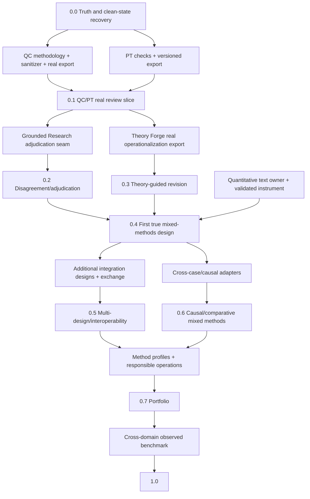

# Mixed Methods Workbench Roadmap

Status: canonical strategy and sequencing authority
Updated: 2026-07-09

## North Star

Build the most rigorous and agent-drivable environment for text-centered
mixed-methods research: one place where a researcher can design a study, govern
its source corpus, conduct methodologically faithful qualitative and
quantitative analyses, test causal and theoretical explanations, integrate
strands explicitly, resolve disagreement, and export a reproducible chain from
source to meta-inference.

The scope is intentionally broad. The execution strategy is not. Each release
delivers one thin, real, inspectable research path and expands the number of
method designs that the workbench can support deeply.

## What `1.0` Means

Version 1.0 does **not** mean that every research tradition is automated. It
means that the workbench provides:

- a governed study/corpus foundation;
- a method-profile system that prevents one tradition's validity rules from
  being imposed on another;
- at least one validated qualitative analysis path;
- at least one validated computational/quantitative text path;
- within-case causal reasoning and theory operationalization without category
  errors;
- at least one genuine qualitative-quantitative integration design with a joint
  display and meta-inference;
- human review, reflexivity, provenance, reporting, and interoperable exports;
- an observed benchmark showing what works, where it fails, and which claims
  remain bounded.

Breadth after 1.0 comes from adding validated method profiles and integration
designs, not from adding generic buttons.

## Goal Map

| Goal | Researcher-visible outcome | Current evidence | 1.0 condition |
|---|---|---|---|
| G1. Trustworthy evidence from text | Every claim traces to governed sources, anchors, transformations, and review decisions. | C/F scaffold evidence | Observed real projects with adversarial provenance failures caught. |
| G2. Methodologically faithful qualitative analysis | Researchers can use appropriate coding, comparison, memoing, negative-case, and theory-building workflows. | Upstream implementation exists; workbench integration is D | One validated path plus extensible method profiles. |
| G3. Causal and theoretical reasoning without conflation | Rival explanations, mechanisms, observables, and theory context remain distinguishable from empirical evidence and effects. | PT implemented but export planned; TF export planned | PT and theory artifacts integrated with method-specific inference semantics. |
| G4. Genuine mixed-methods integration | Qualitative and quantitative strands are connected, built, merged, or embedded into reviewable meta-inferences. | F | One observed design, joint display, contradiction disposition, and integration-quality review. |
| G5. Reproducible collaborative research | Humans and agents can inspect, rerun, adjudicate, and export the same study. | D | Versioned research bundle, roles/decisions, reporting profiles, and exchange formats. |
| G6. Demonstrated SOTA or beyond-SOTA value | The system is faster or more rigorous on named tasks without hiding methodological failures. | F | Multi-domain benchmark with expert review, held-out cases, negative controls, and trace evaluation. |

The detailed capability inventory and ownership map is in
`docs/MIXED_METHODS_CAPABILITY_MAP.md`.

## Version Ladder

### 0.0 — Truth and Clean-State Recovery

Purpose: make repository status and evidence claims trustworthy before further
integration work.

Thin slice:

```text
synthetic contract -> intended invariant-specific negative control
-> honest coverage report -> ecosystem readiness manifest
```

Required outcomes:

- repair the fixture validator and controls so each mutation reaches the
  intended invariant;
- replace false A grades with honest evidence grades;
- separate theory context from empirical evidence in contracts;
- permit method-scoped PT comparative support while rejecting it in QC;
- establish repository and export clean-state gates;
- reconcile canonical plan, status, and concern surfaces.

Release claim: the project has a truthful planning and verification baseline.
It does not have live engine integration.

### 0.1 — Auditable Multi-Method Qualitative Case Review

Purpose: prove that the workbench can integrate real qualitative coding and
process tracing without flattening their methods.

Canonical case: a public, conflict-rich 18 Brumaire source packet, selected to
reuse the strongest process-tracing case while avoiding sensitive interview
data. If source licensing or anchor recovery fails the gate, the plan must name
a replacement public case rather than silently switching to synthetic data.

Thin slice:

```text
public corpus -> qualitative coding export -> process-tracing export
-> linked claim/hypothesis review -> source-to-caveat reviewer packet
```

Dependencies:

1. `qualitative_coding`: methodology realignment (Plan 241), source sanitizer
   (Plan 239), then real workbench export fixture (Plan 242).
2. `process_tracing`: clean the repo check surface and untracked workbench
   state, then implement versioned workbench export (Plan 7).
3. Workbench: typed producer/consumer contracts, compatibility manifest, real
   fixture adapter, static review artifact, and boundary controls.

Release claim: an auditable **multi-method qualitative** workflow exists for one
evaluated case. It is not yet a qualitative-quantitative mixed-methods system.

### 0.2 — Disagreement and Evidence Adjudication

Purpose: make conflict, uncertainty, and verification first-class rather than
letting a single synthesis hide them.

Thin slice:

```text
contested claims from 0.1 -> adjudication request -> independent analyses
-> claim/dispute ledger -> human disposition -> revised reviewer packet
```

Primary dependency: `grounded-research`, consumed as an adjudication service
through a versioned `ClaimDisputeBundle -> AdjudicationResult` seam. Its current
mechanical pipeline is useful, but general methodological validity must be
evaluated on workbench cases rather than inherited from narrow internal
benchmarks.

Release claim: the workbench can expose and resolve evidence disputes with
provenance on evaluated cases.

### 0.3 — Theory-Guided Analysis and Revision

Purpose: connect empirical analysis to explicit constructs, mechanisms,
hypotheses, observables, measures, assumptions, and scope conditions.

Thin slice:

```text
real Theory Forge operationalization -> study protocol context
-> QC/PT links to observables and hypotheses -> empirical challenges
-> theory revision proposal with unresolved obligations
```

Primary dependency: Theory Forge Plan 108 plus one known-green, real
`TheoryOperationalizationArtifact` fixture.

Release claim: theory can guide and be revised by analysis. Theory objects are
not counted as supporting evidence merely because they were generated or
compiled.

### 0.4 — First Genuine Mixed-Methods Design

Purpose: cross the methodological boundary from multiple qualitative methods to
intentional qualitative-quantitative integration.

Pre-made design choice: begin with an **exploratory sequential** design. Use
qualitative categories and anchored examples to define a quantitative coding or
measurement instrument; apply and validate it on a held-out text set; merge the
results in a joint display; and write bounded meta-inferences with explicit
divergence handling.

Thin slice:

```text
qualitative construct discovery -> reviewed measurement specification
-> held-out quantitative text annotation/measurement -> joint display
-> convergence/divergence review -> meta-inference
```

Unresolved dependency that must be decided before execution: ownership of the
quantitative-text adapter/engine. The default is to use established libraries
behind a narrow project-specific adapter for the first real design, and extract
a shared engine only after the slice reveals a stable interface.

Release claim: one evaluated exploratory-sequential mixed-methods design exists.
No causal-effect claim is licensed without a separate identification design.

### 0.5 — Multiple Integration Designs and Interoperability

Purpose: expand from one design to a small portfolio without losing depth.

Add, in risk order:

1. convergent design with independent strand analysis and explicit
   convergence/complementarity/divergence/silence review;
2. explanatory sequential design where quantitative results determine
   qualitative follow-up sampling;
3. embedded design where one strand answers a bounded secondary question;
4. REFI-QDA project/codebook exchange and reproducible tabular/statistical
   exchange;
5. reporting profiles for JARS mixed methods, SRQR/COREQ, and MMAT appraisal.

Release claim: researchers can choose among several explicit integration
designs and exchange work with established research software.

### 0.6 — Causal and Comparative Mixed Methods

Purpose: bridge within-case evidence to cross-case analysis without pretending
that one substitutes for the other.

Thin slices:

- nested analysis: cross-case pattern selects cases, PT investigates mechanism;
- PT results constrain or explain a quantitative model;
- QCA/fsQCA eligibility and truth-table bridge;
- text-as-treatment, mediator, outcome, or confounder designs with declared
  identification assumptions;
- cross-case temporal, event, relational, and network analysis.

Release claim: named causal/comparative designs are supported with explicit
estimands, case-selection logic, measurement error, and identification limits.

### 0.7 — Method Portfolio and Responsible Research Operations

Purpose: broaden qualitative and text-analytic coverage through versioned method
profiles and harden the product for real research teams.

Candidate profiles: reflexive thematic analysis, codebook thematic/content
analysis, grounded theory, framework analysis, narrative analysis, discourse
analysis, conversation analysis, phenomenology/IPA, ethnography, case/document
analysis, qualitative evidence synthesis, supervised text classification,
dictionary analysis, topic/cluster models, semantic scaling, and multilingual
analysis.

Cross-cutting operations: consent/IRB metadata, licensing, de-identification,
access control, translation provenance, collaboration roles, reflexivity,
model/prompt drift, audit retention, and reproducible export bundles.

Release claim: a broader set of traditions is supported through explicit,
method-specific obligations rather than a universal quality score.

### 0.8 — SOTA Evaluation and Product Hardening

Purpose: determine where the integrated system is actually competitive and
where human or methodological limits remain.

Required evaluation dimensions:

- multiple domains, languages, source genres, and study designs;
- frozen source packets, held-out cases, planted failures, and negative
  controls;
- expert rubrics and disagreement, not a fictional universal human ground
  truth;
- task quality, methodological fidelity, calibration, reproducibility, labor,
  time, and real observed cost;
- full multi-stage traces, corruption checks, and model/version drift;
- incumbent workflow baselines and ablations for each engine/integration step.

Release claim: bounded SOTA claims supported by observed comparative evidence.

### 1.0 — Validated Text-Centered Mixed-Methods Workbench

Purpose: promote the capability ladder into a coherent research product.

Gate: G1–G6 meet their 1.0 conditions for named designs and domains; the release
bundle documents unsupported methods and known limits just as prominently as
supported paths.

### 2.x — Beyond-SOTA Adaptive Research System

The post-1.0 frontier is not “more autonomous prose.” It is a closed-loop,
methodologically governed research system:

- contradiction-seeking and disagreement-first agent ensembles;
- active learning, theoretical sampling, case selection, and source design;
- automatic proposal of the next most discriminating source or analysis;
- dynamic calibration and drift detection by method/profile;
- cross-method provenance graphs and counterfactual audit of meta-inferences;
- reusable, third-party method profiles and engine adapters;
- programmatic exhaustive coverage, agent judgment, and explicit human
  direction at the decisions each actor handles best.

## Dependency Graph and Critical Path



The critical path is `0.0 -> QC export + PT export -> 0.1 -> quantitative-text
decision -> 0.4 -> portfolio/evaluation -> 1.0`. Grounded Research and Theory
Forge can progress in parallel after 0.1 and both must be integrated before
0.4 is promoted.

`research_v3` is not on the critical path. Its current docs disagree about
whether it is active or archived. Until an ADR resolves that conflict, treat it
as an experimental deep-investigation artifact producer; use
`open_web_retrieval` for shared retrieval and Grounded Research for adjudication.

## Versioning and Compatibility Rules

Product versions and artifact schema versions are independent. Every durable
artifact carries:

- `schema_id` and semantic `schema_version`;
- producer repository and commit;
- run/trace identifier;
- source and input artifact hashes;
- configuration, prompt, model, and method-profile versions where applicable;
- creation time and validation result;
- claim limits and known unsupported semantics.

Schema rules:

- major: incompatible meaning, removed/renamed required field, or changed
  invariant;
- minor: backward-compatible optional capability;
- patch: clarification or bug repair that does not change valid payload meaning.

Producers validate strict exports. Workbench consumers accept compatible minor
extensions but fail on an unsupported major version or an unknown critical
capability. The workbench owns adapters and a compatibility matrix. Only the
small common envelope should move to `data_contracts`; method payloads remain
owned by their engines until repeated real slices prove they are shared.

## Clean-State Definition

An engine is “ready to integrate” only when all of the following are recorded in
a machine-readable ecosystem manifest:

- canonical repo/branch/commit and clean worktree state;
- no unexplained untracked files or stale conflicting status docs;
- discoverable `make help` and deterministic check, lint, and type commands;
- versioned strict producer schema and a real fixture;
- exact source command, input hashes, producer commit, and validation result;
- honest evidence grade and at least one invariant-specific negative control;
- open concerns, claim limits, and compatibility range;
- no dependency on engine internals, local absolute paths, or unrecoverable
  state.

A green command is not enough. The negative control must be shown to fail for
the intended reason after unrelated gates such as integrity hashes are kept
neutral.

## Sequencing Rules

1. Complete 0.0 before upstream integration code.
2. Stabilize exports in the owning engine repositories; do not reverse-engineer
   internal state in the workbench.
3. Finish the complete end-to-end slice for one public case before adding a
   second method or case.
4. Advance evidence grades in order: doc -> fixture -> schema validated -> test
   -> observed.
5. Keep exploratory quality surfaces instrumented until readouts justify a
   stable gate.
6. Do not let a later version block verification and cleanup of an earlier one.
7. Do not call any version mixed methods without an explicit qualitative-
   quantitative integration operation and meta-inference.

## Immediate Work

The next executable authority is
`docs/plans/003_integration_versioning_and_clean_state.md`. It details 0.0 and
0.1; later versions remain skeletons until their entry gates are reached.

## Methodological Basis

The roadmap treats mixed methods as intentional integration, not mere
co-location, following NIH guidance on connecting, building, merging, and
embedding strands: <https://obssr.od.nih.gov/sites/g/files/mnhszr296/files/Best_Practices_for_Mixed_Methods_Research.pdf>.

Joint displays and meta-inference are first-class because integration can occur
at design, collection, analysis, and interpretation:
<https://pmc.ncbi.nlm.nih.gov/articles/PMC4639381/> and
<https://doi.org/10.1177/16094069221104564>.

Text-analysis claims require explicit validation and uncertainty rather than
face-valid output: <https://unstats.un.org/unsd/trade/events/2014/Beijing/documents/socialmedia/Grimmer%20and%20Stuart%20-%202013.pdf> and
<https://doi.org/10.1080/19312458.2023.2285765>.
