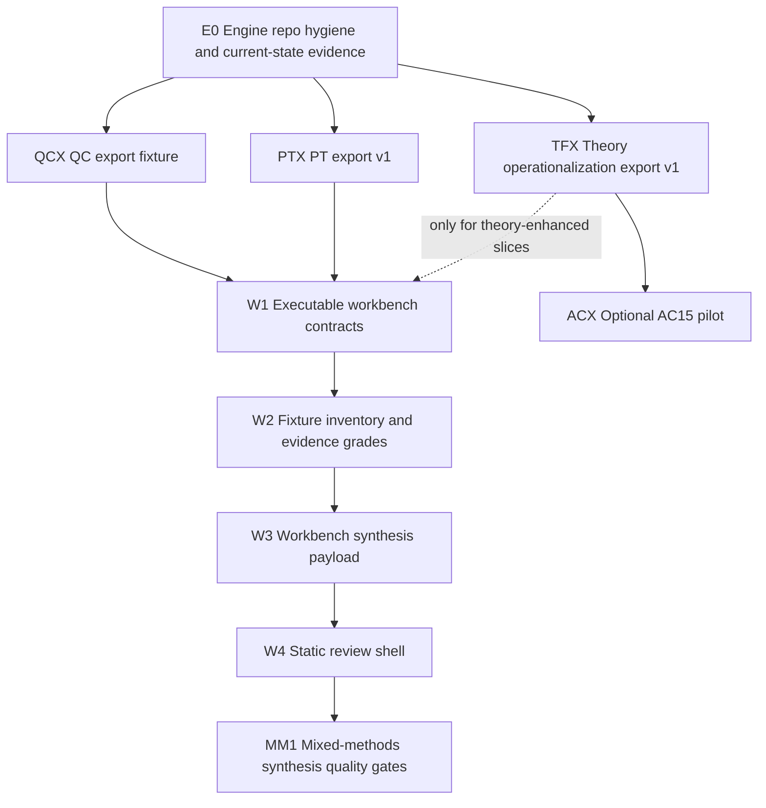

# Plan 002: Engine Stability And Integration Readiness

> Sources: `CLAUDE.md`; `PROJECT.md`; `README.md`; `contracts/shared_contracts.md`;
> `docs/ARCHITECTURE.md`; `docs/CONCERNS.md`;
> `docs/adr/0001_method_engines_not_monorepo.md`;
> `docs/plans/001_walking_skeleton.md`;
> `examples/integration_payload_mockup.md`;
> `~/projects/investigations/cross-project/2026-06-26-mixed-methods-repo-assessment.md`;
> `~/projects/investigations/cross-project/2026-06-26-theory-forge-ac-coupling.md`;
> `~/projects/qualitative_coding/CLAUDE.md`;
> `~/projects/qualitative_coding/docs/PROJECT_THEORY_AND_GOALS.md`;
> `~/projects/qualitative_coding/docs/CAPABILITY_DEPENDENCY_GRAPH.md`;
> `~/projects/process_tracing/CLAUDE.md`;
> `~/projects/process_tracing/ISSUES.md`;
> `~/projects/process_tracing/docs/PROJECT_THEORY_AND_GOALS.md`;
> `~/projects/process_tracing/docs/SOTA_PLUS_TARGET_ARCHITECTURE.md`;
> `~/projects/theory-forge/CLAUDE.md`;
> `~/projects/theory-forge/HANDOFF.md`;
> `~/projects/theory-forge/docs/adr/0003-ac14-integration-deferred.md`;
> `~/projects/theory-forge/docs/plans/05_direct_function_compile.md`;
> `~/projects/theory-forge-24h-automation/docs/plans/03_ac11_schema_compile_pilot.md`;
> `~/projects/theory-forge-24h-automation/docs/plans/04_ac11_graph_schema_compile_pilot.md`;
> `~/projects/theory-forge-24h-automation/docs/plans/08_ac14_codegen_integration.md`;
> `~/projects/ac14/docs/plans/132_theory_forge_input_contract.md`;
> `~/projects/ac14/docs/theory_forge/series_conclusion.md`;
> `~/projects/ac14/RESTART_MANIFEST.md`; worktree/status searches run on
> `theory-forge`, `ac14`, `ac15`, `qualitative_coding`, `process_tracing`, and
> `investigations`.
>
> Status: superseded for sequencing by Plan 003; retained as historical evidence

Created: 2026-06-26

Blocks: `docs/plans/001_walking_skeleton.md`

> Current engine state, version order, clean-state definition, and release gates
> live in `docs/plans/003_integration_versioning_and_clean_state.md`. Do not use
> this June assessment as current worktree evidence.

## Outcome

Do not build out `mixed_methods_workbench` yet. This plan names the readiness
gaps in `qualitative_coding`, `process_tracing`, and `theory-forge`, records the
worktree review, and defines the dependency order for future integration.

The immediate output is a gap map and set of readiness gates. Implementation
slices start only after the relevant engine export seams are stable enough to
license the claims the workbench would make.

## Frame

Goal: turn the current planning scaffold into an eventual mixed-methods
workbench without smuggling unstable engine internals into the workbench.

Constraints:

- Keep `qualitative_coding`, `process_tracing`, and `theory-forge` as separate
  repos with their own claim discipline.
- Use artifact/export contracts before direct imports.
- Preserve method boundaries:
  - QC contributes corpus-grounded evidence, claims, observed patterns, and
    candidate explanations.
  - PT contributes within-case comparative causal support under source-scope
    caveats.
  - Theory Forge may contribute theory operationalization artifacts: constructs,
    mechanisms, hypotheses, observables, assumptions, scope conditions, measures,
    and compiled function metadata.
- AC15 is not on the critical integration path. Any AC15 work is a later,
  non-blocking benchmark or compile-backend experiment after Theory Forge has a
  stable export artifact.

Decision: treat every engine as an artifact producer until a slice proves a
better seam. The workbench owns shared contracts, synthesis policy, review
payloads, and concern triage. It does not own engine implementation.

## Worktree Review Findings

### Theory Forge And AC Lineage

Theory Forge worktrees reviewed:

```text
~/projects/theory-forge
~/projects/theory-forge-24h-automation
~/projects/theory-forge_worktrees/plan-11-automation-baseline
~/projects/theory-forge_worktrees/plan-58-inoculation-compile
~/projects/theory-forge_worktrees/plan-60-sct-compile
~/projects/theory-forge_worktrees/plan-66-ntt-compile
~/projects/theory-forge_worktrees/plan-85-cat-compile
~/worktrees/theory-forge-anomaly-phase18
```

Targeted search for `ac15|AC15` across those Theory Forge worktrees returned no
matches. The remembered AC coupling is not a live Theory Forge -> AC15 coupling.

The historical Theory Forge worktrees show AC11 and AC14 experiments:

- AC11 plans treated AC11 as a schema/bridge/front-end pilot while Theory Forge
  owned downstream compile/runtime gates.
- AC14 Plan #8 was blocked on AC14's NL-to-blueprint capability and expected
  AC14 to return only `compute.py`, with Theory Forge retaining extraction,
  orchestration, prompts, manifests, validators, tests, and runtime.
- Plan #5 made direct function-by-function compilation the default and kept AC8
  optional.
- ADR-0003 deferred AC14 and says Theory Forge does not depend on AC14 for Phase
  1, 2, or 3.

AC14 worktrees reviewed:

```text
~/projects/ac14
~/projects/ac14/worktrees/plan-157-black-scholes
~/worktrees/ac14-anomaly-phase18
~/worktrees/ac14-anomaly-phase18-merge
~/worktrees/ac14-anomaly-phase19
~/worktrees/ac14-anomaly-phase19-merge
```

AC14 references AC15 as restart lineage, not as a Theory Forge live consumer.
The AC14 Theory Forge benchmark series closed with no meaningful `ac14_wins`
verdict, documented information asymmetry, and documented pipeline fragility.
AC15 starts from those lessons, especially per-component validator/healer loops
and benchmark context parity.

AC15 has only the main worktree locally. Current evidence says AC15 inherited
Theory-Forge-derived benchmark fixtures and lessons through AC14. It does not
import Theory Forge and Theory Forge does not import AC15.

## Current Readiness Assessment

| Engine | Current useful role | Blocking gaps before workbench dependency | Integration stance |
|---|---|---|---|
| `qualitative_coding` | Evidence substrate: corpus scope, anchors, claims, observed patterns, abductive candidates, review/evaluation scaffolds. | Current worktree is dirty; need a fresh canonical export fixture and current check evidence. Need choose whether the first workbench fixture uses strict QC-to-PT handoff or another stable QC export. | Strongest near-term producer, but consume only exported artifacts. |
| `process_tracing` | Causal/process-tracing engine: source packets, rival hypotheses, likelihood vectors, deterministic comparative support, absence findings, reports. | Needs `pt_export_v1`; `make check` currently uses the wrong test/runtime surface; global mypy reports errors; untracked `workbench/` must be committed, ignored, or archived before plans depend on it. | Do not parse `result.json` or import `pt.schemas`; wait for versioned export. |
| `theory-forge` | Future theory operationalization producer: theory schema, constructs, mechanisms, operationalized hypotheses, observables, measures, assumptions, compiled metadata. | Current repo health is not green in prior checks; roadmap/HANDOFF conflict around v14/v15 status; Weak Ties runtime amber in handoff; exact mixed-methods export contract is unspecified. | Consume a future `TheoryOperationalizationArtifact`; do not route workbench through AC15/AC14/AC11/AC8. |
| `ac15` | Optional future benchmark/compile-backend experiment. | No tested Theory Forge artifact adapter; current validated interface is not a mixed-methods contract. | Out of critical path. Pilot only after Theory Forge export exists. |

## Modality Split

| Surface | Mode | Treatment |
|---|---|---|
| Repo hygiene and export existence | Deductive | Must be checked with commands and committed artifacts. |
| Shared contract shape | Deductive with broad stubs | Specify Pydantic-style contracts after real export shapes are known. |
| QC and PT adapter mappings | Hybrid | Field mappings are knowable; anchor/quote recovery needs fixture readouts. |
| Theory Forge artifact shape | Dependency subplan | Define a narrow contract stub now; discover exact fields from one real theory export. |
| Mixed-methods synthesis quality | Exploratory | Use real fixture review mockups and human/agent readouts before quality thresholds. |
| AC15 suitability | Exploratory, non-blocking | Run only as a pilot after Theory Forge export is stable. |

## Capability Dependency Graph



| ID | Capability | Owner | Depends on | Current status | Success criteria | Verification artifact | Claim licensed |
|---|---|---|---|---|---|---|---|
| E0 | Engine repo hygiene and current-state evidence | Engine repos | none | partial | Each engine has current `git status`, documented dirty/untracked state, and a known verification command/result. | status/check notes in engine-local plans or investigation | We know what is stable enough to depend on. |
| QCX | QC export fixture | `qualitative_coding` | E0 | partial | One canonical artifact exports scope, hashes, anchors, claims, patterns/candidates, caveats, and rejects causal inference fields. | strict handoff validation plus fixture manifest | QC can supply workbench evidence inputs, not causal proof. |
| PTX | PT export v1 | `process_tracing` | E0 | planned | Versioned export exposes source scope, hypotheses, comparative support, absence findings, verdicts, run metadata, and caveats without raw internals. | `pt_export_v1.json` fixture and tests | PT results can be consumed without internal coupling. |
| TFX | Theory operationalization export v1 | `theory-forge` | E0 | planned | One stable artifact exposes theory constructs, mechanisms, hypotheses, observables, measures, assumptions, scope conditions, uncertainties, validation obligations, and compiled metadata. | one exported artifact from a current green theory plus schema validation | Theory can enter workbench as an inspectable operationalization, not as validated truth. |
| W1 | Executable workbench contracts | `mixed_methods_workbench` | QCX, PTX; optionally TFX | contract stub | Pydantic producer/consumer models and JSON Schema validate all selected fixtures. | synthetic fixture validator plus negative controls | Workbench has an enforceable synthetic seam, not real engine readiness. |
| W2 | Fixture inventory and evidence grades | `mixed_methods_workbench` | W1 | baseline report | Every fixture has source command, hash, engine commit, caveats, and evidence grade. | `docs/coverage_report.md` / `docs/coverage_report.json` | Readiness is visible before enforcement. |
| W3 | Workbench synthesis payload | `mixed_methods_workbench` | W2 | planned | One payload preserves evidence anchors, scope, estimands, method outputs, caveats, and provenance. | fixture-backed JSON plus validation | A static integrated payload exists. |
| W4 | Static review shell | `mixed_methods_workbench` | W3 | planned | Reviewer can trace question -> source scope -> evidence -> QC claim/pattern -> PT support -> caveat without reading raw engine JSON. | static HTML/Markdown review artifact | Review workflow exists over fixtures. |
| MM1 | Mixed-methods synthesis quality gates | `mixed_methods_workbench` | W4 | exploratory | Human/agent review identifies failure modes and stable quality criteria from real fixture payloads. | adversarial review notes and concern dispositions | Limited synthesis-quality claims for evaluated cases only. |
| ACX | Optional AC15 pilot | `ac15` + `theory-forge` | TFX | optional | One Theory Forge artifact maps into an AC15 structured spec/blueprint path and generated output passes Theory Forge tests. | pilot report; no workbench runtime dependency | AC15 may be useful as a backend experiment, not an integration prerequisite. |

## Dependency Subplans

### Current Local Contract Stub

`examples/fixtures/workbench_contract_v1/` now provides synthetic fixture
contracts and `make check` validation. This upgrades W1 from markdown-only to a
contract-stub state, but it does not satisfy QCX, PTX, or TFX. The fixtures are
graded `C-synthetic-contract-only` and must be replaced by real engine-produced
fixtures before Plan 001 can execute.

`docs/coverage_report.md` is the current W2 baseline. It grades W1 and W2 as
tested synthetic scaffolding, W3 as synthetic fixture-only, and QCX/PTX/TFX/W4
/MM1 as still blocked by missing real evidence. Do not promote any D row into
`make check` until its negative control exists.

### Dependency Subplan: QC Export Fixture

Blocks: `W1`, `W2`, and any QC side of Plan 001.

Known stub: a QC artifact can provide `SourceScope`, `SourceAnchor`,
`EvidenceRecord`, `AnalyticAssertion`, `PatternFinding`, candidate explanation
metadata, provenance, and caveats.

Unknowns:

- Which current QC artifact should become canonical for the first workbench
  fixture.
- Whether the current dirty worktree changes readiness or export shape.
- Whether to consume the QC-to-PT handoff package directly or define a separate
  workbench-safe QC export.

Instrument: run the engine-local validation command for the chosen artifact and
write a fixture manifest with hashes, engine commit, and caveats.

Readout: one fixture validates and contains at least one anchored claim, one
observed pattern or candidate explanation, source scope, provenance, and no PT
inference fields.

Promotion: update workbench contracts and Plan 001 fixture references with exact
QC mapping rules.

### Dependency Subplan: PT Export V1

Blocks: `W1`, `W2`, and the PT side of Plan 001.

Known stub: PT should export source scope, hypotheses, comparative support,
absence findings, verdicts, run metadata, and claim limits.

Unknowns:

- Exact `pt_export_v1` field names and whether numeric comparative weights are
  exposed directly or banded in the workbench view.
- Whether evidence quote offsets can be recovered or only source markers are
  available in v1.
- Fate of untracked `process_tracing/workbench/`.

Instrument: create or review an engine-local PT export plan, fix the `make check`
surface, and generate one public fixture under a versioned export schema.

Readout: one fixture validates without importing `pt.schemas` or parsing
`result.json`, and the export carries explicit comparative-support labels and
source-coverage caveats.

Promotion: update shared contracts and Plan 001 with the exact PT mapping rules.

### Dependency Subplan: Theory Operationalization Artifact

Blocks: theory-enhanced workbench slices and any plan that asks the workbench to
generate or consume theory.

Known stub: Theory Forge can eventually provide a theory artifact with concepts,
constructs, mechanisms, hypotheses, observables, measures, assumptions, scope
conditions, uncertainties, validation obligations, and compiled module metadata.

Unknowns:

- Whether the canonical source is v14 schema, v15 schema, compiled manifest, or a
  new export that composes those.
- Which current theory is green enough for a first fixture.
- How to distinguish generated theory, operationalized theory, and compiled
  analysis code in the workbench domain model.
- Current Theory Forge health status after known stale roadmap/HANDOFF issues.

Instrument: run a dedicated Theory Forge health/readiness investigation, pick one
green theory, and draft one `TheoryOperationalizationArtifact` mockup from real
schema/manifest fields.

Readout: one artifact validates, has provenance to a real theory schema/compiled
manifest, and can be linked to QC/PT objects without requiring AC runtime.

Promotion: add the artifact to `contracts/shared_contracts.md`, update
`docs/ARCHITECTURE.md`, and create a theory-enhanced workbench slice.

### Dependency Subplan: Optional AC15 Pilot

Blocks: no workbench slice.

Known stub: AC15 may be able to consume a Theory Forge artifact through a
structured-spec or blueprint path, but this is untested.

Unknowns:

- Whether AC15's current structured-spec surface can represent theory
  operationalization without category errors.
- Whether AC15 can produce useful compute artifacts for Theory Forge after
  context parity controls.

Instrument: after `TFX`, run one pilot mapping a Theory Forge export into AC15 and
judge the output with Theory Forge tests.

Readout: pilot pass/fail with no workbench dependency.

Promotion: if useful, record as an optional compile-backend path in Theory Forge,
not as a mixed-methods workbench prerequisite.

## Risk-Ordered Roadmap

### Slice 0: Readiness Ledger And Gap Map

Advances: turns uncertain repo/worktree history into explicit integration
blockers.

Vertical scope: docs only - worktree review, dependency graph, Plan 001 blocker,
concern register updates.

Success: this plan exists; Plan 001 is blocked by readiness gates; concerns and
uncertainties are explicit.

Audit: check that no implementation or live integration is implied.

Cleanup: keep the mock payload marked as invented.

Done when: docs updated, links valid enough for current scaffold, git state
committed.

### Slice 1: Engine Export Stabilization

Advances: resolves upstream dependencies before workbench code.

Vertical scope:

- QC: canonical export fixture and validation evidence.
- PT: `pt_export_v1` and deterministic repo check surface.
- TF: health/readiness investigation and `TheoryOperationalizationArtifact`
  draft from a real green theory.

Success:

- QCX and PTX pass for Plan 001.
- TFX may remain separate if the first walking skeleton is intentionally QC/PT
  only.

Audit: adversarially check that no engine leaks internal schemas into the
workbench.

Cleanup: commit or dispose of dirty/untracked engine work before depending on it.

Done when: each included engine has a versioned fixture/export and a documented
verification command.

### Slice 2: Executable Workbench Contract Package

Advances: turns markdown shared contracts into a tested seam.

Vertical scope: Pydantic models, JSON Schema export, fixture validation tests,
and a fixture manifest.

Success: selected QC/PT fixtures validate; if TFX is included, the theory artifact
validates separately without forcing it into QC/PT semantics.

Audit: try to pass PT comparative support as generic confidence, QC candidate
explanation as causal proof, and Theory Forge operationalization as validated
theory. All must fail or carry explicit caveats.

Cleanup: replace or quarantine invented examples.

Done when: contract tests pass and the concern register is triaged.

### Slice 3: Resume Plan 001 Walking Skeleton

Advances: first workbench-visible payload.

Vertical scope: artifact adapters -> shared contracts -> `WorkbenchSynthesis` ->
static review payload.

Success: as in Plan 001, but only after Slice 1/2 have licensed the dependencies.

Audit: method-boundary and estimand-conflation review.

Cleanup: no direct engine imports unless a new ADR approves them.

Done when: Plan 001 done-when criteria pass.

## Acceptance Criteria For This Plan

- Worktree review findings are recorded, including no AC15 matches in Theory
  Forge worktrees.
- Plan 001 is explicitly blocked by engine readiness.
- QC, PT, Theory Forge, and AC15 roles are separated.
- Capability dependency graph names owner, dependency, status, success criteria,
  verification artifact, and licensed claim.
- Dependency subplans have stubs, unknowns, instruments, readouts, and promotion
  conditions.
- All known uncertainties are explicit.

## Uncertainties

| ID | Uncertainty | Impact | What would resolve it |
|---|---|---|---|
| U-MM-001 | Current `qualitative_coding` dirty files may affect export readiness or docs. | Medium | Fresh engine-local status/check after those changes are either committed or understood. |
| U-MM-002 | Canonical QC fixture is not selected. | Medium | Pick one fixture and validate it with a recorded command/hash. |
| U-MM-003 | The correct QC workbench export may be the QC-to-PT handoff or a separate workbench export. | Medium | Compare fields against W1 contracts after one fixture. |
| U-MM-004 | `process_tracing` has no versioned workbench export yet. | High | Implement or approve `pt_export_v1` with fixture tests. |
| U-MM-005 | `process_tracing/workbench/` is untracked and therefore not a durable dependency. | Medium | Commit, ignore, or archive it with an issue/plan. |
| U-MM-006 | PT numeric comparative-support fields may be misread as truth probabilities. | High | Contract labels, UI labels, and tests that forbid generic confidence. |
| U-MM-007 | Theory Forge v14/v15 status conflicts across current docs and handoff. | High | Dedicated Theory Forge health/readiness investigation against code, schemas, manifests, and tests. |
| U-MM-008 | Theory Forge's current checks were previously not green. | High | Fresh health run or triage plan in Theory Forge. |
| U-MM-009 | Exact `TheoryOperationalizationArtifact` shape is not specified. | High | Draft from one real green theory and validate. |
| U-MM-010 | It is unclear whether the workbench should consume "generated theory", "theory operationalization", or "compiled analysis module" first. | High | ADR after TFX readout; default to operationalization artifact. |
| U-MM-011 | Historical archive/remote branch search for abandoned AC15 adapters is not exhaustive. | Low/Medium | Search remotes/archives only if historical certainty is worth the cost. |
| U-MM-012 | AC15 future usefulness as a Theory Forge backend is untested. | Medium | Optional ACX pilot after TFX. |
| U-MM-013 | Mixed-methods synthesis usefulness is unknown until a real fixture review. | High | Static review mockup with real fixture data and adversarial review. |

## Recommendations

1. Keep `mixed_methods_workbench` in planning mode until QCX and PTX are real.
2. Do not make Theory Forge or AC15 a dependency of the first QC/PT walking
   skeleton.
3. Add Theory Forge as a planned artifact producer, not as a live compiler
   service.
4. Fix engine repo hygiene in the owning repos before writing workbench adapters.
5. After engine exports exist, make executable contracts the next workbench slice,
   then resume Plan 001.
