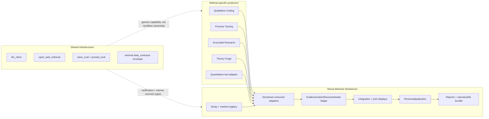
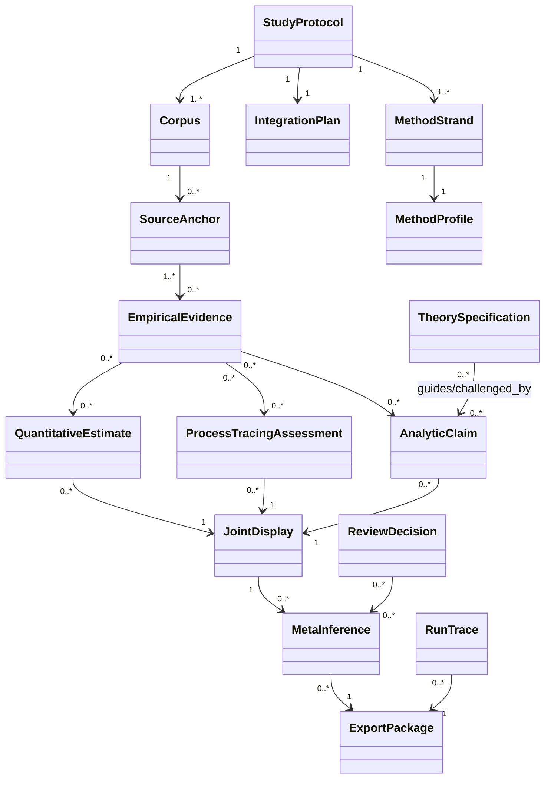

# Plan 003: Integration, Versioning, and Clean-State Recovery

Status: active — canonical execution authority for versions 0.0 and 0.1
Created: 2026-07-09
Supersedes for sequencing: `docs/plans/002_engine_stability_and_integration_readiness.md`
Unblocks and reframes: `docs/plans/001_walking_skeleton.md`

## Mission

Preserve the complete text-centered mixed-methods north star while moving the
ecosystem into a trustworthy clean state and delivering the first thin, real,
methodologically honest integration slice.

The plan succeeds when:

1. evidence grades and repository checks tell the truth;
2. engine boundaries and artifact versions are explicit;
3. one public case can be traced from governed text through qualitative coding
   and process tracing into an auditable reviewer packet;
4. the result is labeled multi-method qualitative research, not falsely called
   qualitative-quantitative mixed methods; and
5. the next versions have dependency skeletons without speculative schemas.

## Modality

This work is hybrid.

| Surface | Mode | Treatment |
|---|---|---|
| Evidence grades, hashes, schema versions, repo hygiene | Deductive | Specify and test now. |
| Method boundaries and category distinctions | Deductive | Encode in contracts and negative controls. |
| QC/PT real artifact mappings | Hybrid | Specify required semantics; learn field mappings from real fixtures. |
| Reviewer usability and synthesis quality | Exploratory | Build a static readout, observe failures, then promote stable gates. |
| Full method portfolio | Dependency skeleton | Preserve scope and ownership; do not implement generic abstractions. |
| Quantitative-text engine | Exploratory dependency decision | Select the first design and established tools before extracting an engine. |

## Decisions Already Made

- The project remains broad; releases remain thin.
- Product versions, producer-schema versions, and method-profile versions are
  independent.
- Method engines remain separate repositories and own strict producer exports.
- The workbench owns compatible consumers, orchestration, integration, review,
  reporting, and the compatibility manifest.
- Theory operationalizations are context/design objects, never
  `EmpiricalEvidence`.
- The first real case is a public 18 Brumaire corpus/source packet unless a
  documented licensing or source-recovery failure blocks it.
- Version 0.1 integrates QC and PT and is labeled multi-method qualitative.
- Version 0.4 is the first release allowed to claim mixed methods; it begins with
  an exploratory-sequential qual-to-quant design.
- Grounded Research and Theory Forge integrate after 0.1 and can proceed in
  parallel.
- `research_v3` is not on the critical path until its active-versus-archived
  ownership conflict is resolved by ADR.
- AC-family compile agents are not workbench runtime dependencies.

## Requirements → Boundaries → Domain → Contracts → Schema

### Requirements

R1. Every artifact and claim must be traceable to a study protocol, sources,
transformations, producing method, run, and review state.

R2. Method outputs must retain distinct inference semantics. Qualitative support,
PT comparative support, quantitative estimates, and integrated meta-inferences
cannot share a generic confidence field.

R3. Every release must exercise a complete researcher path with real data and a
useful output.

R4. Method validity must be profile-specific. A rule suitable for structured
codebook coding cannot silently govern reflexive thematic analysis, grounded
theory, discourse analysis, or another tradition.

R5. An integration result must record how strands were connected, built,
merged, or embedded and how convergence, complementarity, divergence, and
silence were handled.

R6. Agents and humans must see the same state through APIs/artifacts, including
review decisions, concerns, failures, and provenance.

R7. Claims about readiness, methodological quality, or SOTA performance must be
bounded by observed evidence and discriminating controls.

### Boundaries



The workbench does not read producer internals, execute ad hoc SQL against
another repo's state, or infer a contract from `result.json`. The first seam is
a committed, versioned artifact.

### Domain Model



The relationship `TheorySpecification guides/challenged_by AnalyticClaim`
replaces the existing category error in which theory operationalization is
represented as empirical evidence supporting an assertion.

### Contract Portfolio

| Contract | Producer → consumer | Earliest version | Required semantics |
|---|---|---:|---|
| `QualitativeEvidenceExport` | QC → workbench | 0.1 | Corpus denominator, source identity/hashes, anchors, codes/categories/claims/patterns, memos/review, claim limits; no PT inference. |
| `ProcessTracingExport` | PT → workbench | 0.1 | Question/case/source packet, rival hypothesis partition, evidence/absence findings, comparative support, sensitivity, caveats, report refs. |
| `ClaimDisputeBundle` / `AdjudicationResult` | Workbench ↔ Grounded Research | 0.2 | Contested claims, evidence packets, independent analyses, verification actions, disagreement and human disposition. |
| `TheoryOperationalizationArtifact` | Theory Forge → workbench | 0.3 | Constructs, mechanisms, hypotheses, observables, measures, assumptions, scope, uncertainty, validation obligations; no empirical support. |
| `QuantitativeTextDataset` / `QuantitativeTextResult` | Workbench ↔ first quant adapter | 0.4 | Derivation from qualitative constructs, label/measurement protocol, splits, metrics/errors/uncertainty, per-item linkage. |
| `IntegrationReview` | Workbench internal/export | 0.4 | Design, integration operation, joint display, strand relationships, contradiction dispositions, meta-inferences, claim limits. |
| `ResearchBundle` | Workbench → researcher/reviewer | 0.1+, hardened by 1.0 | Protocol, manifests, artifacts, decisions, traces, compatibility, environment, report. |

### Schema Envelope

Each artifact must include a narrow common envelope:

```yaml
schema_id: producer.namespace.artifact
schema_version: 1.0.0
producer:
  repository: owner/name
  commit: full-git-sha
run:
  trace_id: stable-id
  created_at: ISO-8601
method_profile:
  id: method-name
  version: semver
inputs:
  - artifact_id: stable-id
    sha256: hex
validation:
  command: exact-command
  result: passed|failed
  checked_at: ISO-8601
claim_limits: [explicit-limit]
extensions: {}
```

The envelope moves to `data_contracts` only after QC and PT real fixtures prove
the common fields. Producer payloads remain local. Producer models use
`extra="forbid"`; workbench consumers tolerate compatible optional additions
but fail on unsupported major versions and unknown critical capabilities.

## Version 0.0: Truth and Clean-State Recovery

### Slice 0A — Repair the Verification Signal

Work:

- make semantic negative controls recompute fixture hashes so they reach the
  intended semantic gate;
- assert each control fails with its expected diagnostic, not merely any
  `SystemExit`;
- scope forbidden inference fields by producer so QC rejects PT inference while
  PT can export method-specific comparative support;
- add controls for missing source identity, empty/malformed claim limits,
  generic confidence, unsupported schema major, and theory-as-evidence;
- replace ad hoc recursive checks with typed schema validation in the next
  implementation increment.

Current first repair: the hash-neutral, expected-diagnostic controls and
producer-scoped inference rule are implemented in this plan's opening change.
The additional schema controls remain the next 0.0 implementation increment.

### Slice 0B — Make Coverage Honest

Work:

- grade the synthetic seam C, not A;
- grade the incomplete fixture inventory F;
- derive grades from inspectable evidence rather than treating “test ran” as
  proof of the requirement;
- add a coverage row for repository clean-state and contract category safety;
- require a negative control before a row can become an enforced A-grade gate.

### Slice 0C — Reconcile Contract and Documentation Authority

Work:

- revise `contracts/shared_contracts.md` to match the domain distinctions above;
- replace `EvidenceRecord(evidence_kind=theory_operationalization)` with a
  separate theory/context collection;
- add the artifact version envelope and compatibility policy;
- update architecture diagrams and the synthetic fixtures;
- mark Plan 002 historical and Plan 003 canonical;
- label Plan 001/version 0.1 as multi-method qualitative;
- remove stale engine-readiness claims and record current upstream plan IDs.

### Slice 0D — Ecosystem Clean-State Manifest

Create a read-only readiness command and manifest in this repo. It must record,
not mutate:

- repository, canonical branch, HEAD, upstream relationship, clean/dirty state;
- unexplained untracked paths and active coordination claims;
- canonical status/plan documents and any conflicts;
- supported export schema versions and fixture hashes;
- exact check/lint/type commands and results;
- evidence grades, negative controls, and open concerns.

The command fails for missing evidence; it does not silently label an unknown
engine “not applicable.” Cleanup stays in the owning repo under an engine-local
plan.

### 0.0 Acceptance Criteria

| ID | Criterion | Current | Required | Verification |
|---|---|---:|---:|---|
| T0.1 | Each negative control reaches its named invariant. | C after first repair | A | Tests assert exact diagnostic after neutralizing unrelated hashes. |
| T0.2 | Coverage report matches actual evidence. | C/F corrected baseline | A | Independent recomputation plus deliberate evidence removal makes the grade fall. |
| T0.3 | Theory cannot validate as empirical evidence. | F | A | Schema and negative test. |
| T0.4 | PT comparative support is allowed only in PT-scoped payloads. | C | A | Positive PT control plus negative QC/generic controls. |
| T0.5 | Strict typed contracts validate and honestly bound all synthetic fixtures. | C | C | Pydantic/JSON Schema tests, schema snapshots, and synthetic claim limits. |
| T0.6 | Readiness manifest reports all included repos without mutation. | F | B initially | Observed run saved with repo commits and check results. |
| T0.7 | Canonical docs agree on scope, status, sequence, and labels. | C after this plan | A | Link/content consistency test plus review. |

0.0 exits only when T0.1–T0.7 meet their required grades. The first repair does
not by itself complete the version.

## Version 0.1: Real QC → PT Review Slice

### Upstream Order

#### A. Qualitative Coding

1. Complete
   `~/projects/qualitative_coding/docs/plans/SOTA_METHODODOLOGY_PIPELINE_REALIGNMENT.md`
   (Plan 241) so the
   default method path and claim language are truthful.
2. Complete
   `~/projects/qualitative_coding/docs/plans/AGENT_DRIVABLE_SANITIZATION_WORKFLOW.md`
   (Plan 239) so a real
   public fixture and any future sensitive corpus have an auditable release
   path.
3. Complete
   `~/projects/qualitative_coding/docs/plans/MIXED_METHODS_WORKBENCH_EXPORT_FIXTURE.md`
   (Plan 242) using the
   18 Brumaire corpus.
4. Include corpus scope/denominator, source hashes, anchors, codes/categories,
   claims, negative cases, candidate explanations, review state, memos, method
   profile, producer commit, and claim limits.
5. Prove the producer rejects likelihoods, posteriors, and comparative support.

Do not block 0.1 on perfect completion of every qualitative method profile. Do
block on a methodologically coherent path for the selected case and export.

#### B. Process Tracing

1. Resolve the documented `make check`/environment and mypy failures.
2. Disposition untracked `workbench/frontend/node_modules/` through ignore,
   cleanup, or an explicit retained-state decision.
3. Complete
   `~/projects/process_tracing/docs/plans/007_workbench_export_v1.md` against
   the same Brumaire case.
4. Export source packet identity/coverage, rival hypothesis partition,
   observables, evidence and absence findings, comparative support, sensitivity,
   verdict language, caveats, run metadata, and report references.
5. Prove the export can be consumed without importing `pt.schemas` or parsing
   internal `result.json`.

The stable export lets PT continue improving source design, partition audits,
trace production, dependence modeling, provenance guards, and formal
validation without blocking workbench adapters.

#### C. Workbench

1. Import pinned real exports and record hashes/producer commits.
2. Implement strict producer schemas and compatible consumer adapters.
3. Link the two strands through shared source/case/question identity, not fuzzy
   text matching.
4. Produce one `ResearchBundle` and static reviewer packet.
5. Run adversarial boundary controls and a human/agent review readout.
6. Update the contract from observed mapping failures before building UI.

### 0.1 Acceptance Criteria

| ID | Criterion | Evidence class | Required grade | Verification artifact |
|---|---|---|---:|---|
| Q1 | Real QC export is provenance-complete and method-valid for the selected case. | observed + test | A | Engine fixture, strict validation, negative controls, expert/method review. |
| P1 | Real PT export is provenance-complete and retains method-specific support/caveats. | observed + test | A | Versioned export fixture and tests. |
| W1 | Adapters consume only exported artifacts and preserve every required field. | test | A | Contract tests using pinned producer fixtures. |
| W2 | Shared source/case/question identities resolve without heuristic matching. | test | A | Cross-artifact identity assertions and collision control. |
| W3 | Reviewer traces question → source → QC claim/pattern → PT hypothesis/support → caveat. | observed | B | Static packet plus recorded review. |
| W4 | Unsupported assertions, source gaps, and method boundaries remain visible. | observed + negative controls | A | Planted failures shown in packet or blocked. |
| W5 | Release and documentation call the result multi-method qualitative, not true mixed methods. | test/review | A | Terminology check and human review. |
| W6 | Full command, trace, cost, config, model/prompt versions, and environment are recoverable. | observed | B | Research bundle manifest and trace catalog. |

## Later Version Dependency Skeletons

### 0.2 Grounded Research

Entry: 0.1 reviewer packet exposes real contested claims.

Exit: a versioned adjudication seam returns independent analyses, verification
actions, disagreement types, and human dispositions for those claims. Evaluate
Grounded Research on the workbench case; do not inherit “general validity” from
its current narrow benchmarks.

### 0.3 Theory Forge

Entry: one known-green Theory Forge export exists under Plan 108.

Exit: theory objects guide observable/measure/hypothesis links, empirical
results can challenge them, and no theory object appears in empirical evidence.

### 0.4 Quantitative Text and First Mixed Design

Entry: assign an owner, choose the quantitative task and held-out set, write a
measurement/annotation protocol, and freeze the qualitative discovery set.

Exit: exploratory-sequential joint display and meta-inference pass method,
measurement, leakage, and contradiction controls.

### 0.5–1.0

Keep only the skeleton in `docs/ROADMAP.md` until 0.4 readouts reveal stable
integration contracts. Detail convergent/explanatory/embedded designs,
causal/comparative bridges, method profiles, reporting/interoperability, and
SOTA evaluation at their entry gates.

## Failure Modes and What to Try Next

| Failure | Meaning | Next action |
|---|---|---|
| Brumaire QC corpus cannot be legally or reliably reconstructed | Case fixture is unsuitable, not permission to use synthetic data. | Record source/license failure; select another public, conflict-rich case with both QC and PT fit. |
| QC/PT source identity cannot align | Contracts lack shared source registry semantics. | Add explicit registry IDs and provenance mapping in producer exports; do not fuzzy-match quotes. |
| PT export needs internal-only state | Export plan is incomplete. | Add the smallest missing producer field and test it in PT; do not import internals. |
| Joint reviewer packet looks coherent but hides a planted gap | Readout is persuasive but not discriminating. | Add the failure as a negative control before promotion. |
| One generic contract accumulates method-specific fields | Schema monolith is forming. | Split common envelope from producer payload and integration links. |
| Researcher cannot explain why strands were combined | The UI is co-location, not integration. | Return to `IntegrationPlan`; require named operation and intended meta-inference. |
| Quant method changes after seeing held-out results | Leakage/adaptive overfitting. | Freeze discovery/validation roles, record deviation, obtain a new held-out set. |
| Expert reviewers disagree | Not automatically a failure. | Preserve rationales, classify disagreement, adjudicate consequential items, report residual uncertainty. |
| Engine remains dirty or docs conflict | Readiness is unknown. | Stop consumption, repair in owning repo, regenerate the readiness manifest. |
| Three attempts fail without new evidence | Circuit breaker reached. | Log failure, preserve artifacts, move to the next independent critical-path task. |

## Concern Register Updates Required During Execution

Every newly observed defect or strategic uncertainty must enter
`docs/CONCERNS.md` before further implementation. Minimum standing concerns are
validator adequacy, false coverage confidence, method labeling, theory/evidence
separation, missing quantitative owner, upstream plan/version drift, privacy,
method-profile validity, and benchmark independence.

## Sources Consulted

This plan synthesizes the complete tracked workbench baseline as reviewed on
2026-07-09:

- `README.md`, `PROJECT.md`, `CLAUDE.md`, `Makefile`;
- `contracts/shared_contracts.md`;
- `docs/ARCHITECTURE.md`, `docs/CONCERNS.md`,
  `docs/IMPLEMENTING_AGENT_NOTES.md`, `docs/coverage_report.md`,
  `docs/coverage_report.json`, `docs/wiki_manifest.yaml`;
- `docs/adr/0001_method_engines_not_monorepo.md`;
- `docs/plans/001_walking_skeleton.md`,
  `docs/plans/002_engine_stability_and_integration_readiness.md`;
- `examples/integration_payload_mockup.md`;
- all files under `examples/fixtures/workbench_contract_v1/`;
- `scripts/check_coverage.py`, `scripts/check_fixture_negative_controls.py`,
  `scripts/validate_fixtures.py`.

Relevant ecosystem sources consulted:

- `~/projects/investigations/cross-project/2026-06-26-mixed-methods-repo-assessment.md`;
- `~/projects/qualitative_coding/CLAUDE.md`,
  `~/projects/qualitative_coding/PROJECT.md`,
  `~/projects/qualitative_coding/docs/PROJECT_THEORY_AND_GOALS.md`,
  `~/projects/qualitative_coding/docs/CAPABILITY_DEPENDENCY_GRAPH.md`,
  `~/projects/qualitative_coding/docs/plans/ACTIVE_SPRINT.md`,
  `~/projects/qualitative_coding/docs/plans/SOTA_METHODODOLOGY_PIPELINE_REALIGNMENT.md`,
  `~/projects/qualitative_coding/docs/plans/AGENT_DRIVABLE_SANITIZATION_WORKFLOW.md`,
  and `~/projects/qualitative_coding/docs/plans/MIXED_METHODS_WORKBENCH_EXPORT_FIXTURE.md`;
- `~/projects/process_tracing/CLAUDE.md`,
  `~/projects/process_tracing/PROJECT.md`,
  `~/projects/process_tracing/ISSUES.md`,
  `~/projects/process_tracing/docs/PROJECT_THEORY_AND_GOALS.md`,
  `~/projects/process_tracing/docs/SOTA_PLUS_TARGET_ARCHITECTURE.md`,
  `~/projects/process_tracing/docs/plans/002_sota_plus_recovery_plan.md`,
  `~/projects/process_tracing/docs/plans/003_sota_plus_execution_master_plan.md`,
  `~/projects/process_tracing/docs/plans/006_source_design_engine.md`,
  `~/projects/process_tracing/docs/plans/007_workbench_export_v1.md`, and
  `~/projects/process_tracing/docs/plans/sota_plus_concern_register.md`;
- `~/projects/grounded-research/CLAUDE.md`,
  `~/projects/grounded-research/PROJECT.md`,
  `~/projects/grounded-research/docs/ROADMAP.md`,
  `~/projects/grounded-research/docs/ops/CAPABILITY_DECOMPOSITION.md`, and
  `~/projects/grounded-research/docs/adr/0007-dual-entry-mode.md`;
- `~/projects/theory-forge/CLAUDE.md`,
  `~/projects/theory-forge/PROJECT.md`,
  `~/projects/theory-forge/HANDOFF.md`,
  `~/projects/theory-forge/ISSUES.md`,
  `~/projects/theory-forge/docs/ROADMAP.md`,
  `~/projects/theory-forge/docs/adr/0003-ac14-integration-deferred.md`, and
  `~/projects/theory-forge/docs/plans/108_mixed_methods_operationalization_export.md`;
- `~/projects/research_v3/CLAUDE.md`,
  `~/projects/research_v3/PROJECT.md`,
  `~/projects/research_v3/HANDOFF.md`, and
  `~/projects/research_v3/ROADMAP.md`;
- current git/check state of `data_contracts`, `llm_client`, `trace_eval`,
  `prompt_eval`, and `open_web_retrieval`.

Public methodological sources:

- NIH mixed-methods best practices:
  <https://obssr.od.nih.gov/sites/g/files/mnhszr296/files/Best_Practices_for_Mixed_Methods_Research.pdf>;
- joint displays/meta-inference:
  <https://pmc.ncbi.nlm.nih.gov/articles/PMC4639381/> and
  <https://doi.org/10.1177/16094069221104564>;
- REFI-QDA: <https://www.qdasoftware.org/>;
- JARS/COREQ/SRQR/MMAT reporting and appraisal:
  <https://www.equator-network.org/reporting-guidelines/journal-article-reporting-standards-for-qualitative-primary-qualitative-meta-analytic-and-mixed-methods-research-in-psychology-the-apa-publications-and-communications-board-task-force-report/>,
  <https://www.equator-network.org/reporting-guidelines/coreq/>,
  <https://www.equator-network.org/reporting-guidelines/srqr/>, and
  <https://mixedmethodsappraisaltoolpublic.pbworks.com/w/file/fetch/127916259/MMAT_2018_criteria.pdf>;
- text-as-data validity and causal text:
  <https://unstats.un.org/unsd/trade/events/2014/Beijing/documents/socialmedia/Grimmer%20and%20Stuart%20-%202013.pdf>,
  <https://doi.org/10.1080/19312458.2023.2285765>, and
  <https://pmc.ncbi.nlm.nih.gov/articles/PMC9581481/>;
- computational grounded theory:
  <https://csuned.github.io/resources/nelson-computational-grounded-theory-rotated.pdf>;
- data governance and responsible AI:
  <https://www.unesco.org/en/articles/guidance-generative-ai-education-and-research?hub=67098> and
  <https://wpvip.icpsr.umich.edu/icpsr/wp-content/uploads/sites/11/2025/06/Guide-for-Sharing-Qualitative-Data-at-ICPSR-V2.pdf>;
- qualitative quality, reflexivity, and transformation:
  <https://www.tandfonline.com/doi/abs/10.1080/14780887.2020.1769238>,
  <https://link.springer.com/article/10.1140/epjds/s13688-025-00548-8>, and
  <https://pmc.ncbi.nlm.nih.gov/articles/PMC2768355/>;
- process tracing and mixed causal design:
  <https://www.cambridge.org/core/journals/ps-political-science-and-politics/article/understanding-process-tracing/183A057AD6A36783E678CB37440346D1>,
  <https://www.cambridge.org/core/journals/political-analysis/article/abs/updating-bayesians-a-critical-evaluation-of-bayesian-process-tracing/3F9504656A884F380AE64151F5C8BE06>, and
  <https://journals.sagepub.com/doi/10.1177/00491241241295336>;
- evidence synthesis/reporting:
  <https://www.who.int/publications/i/item/WHO-EURO-2021-2272-42027-57819> and
  <https://www.prisma-statement.org/home>;
- evidence on LLM-assisted annotation and its limits:
  <https://pubmed.ncbi.nlm.nih.gov/37463210/>,
  <https://arxiv.org/abs/2503.22040>,
  <https://arxiv.org/abs/2602.19467>, and
  <https://arxiv.org/abs/2601.12099>.
