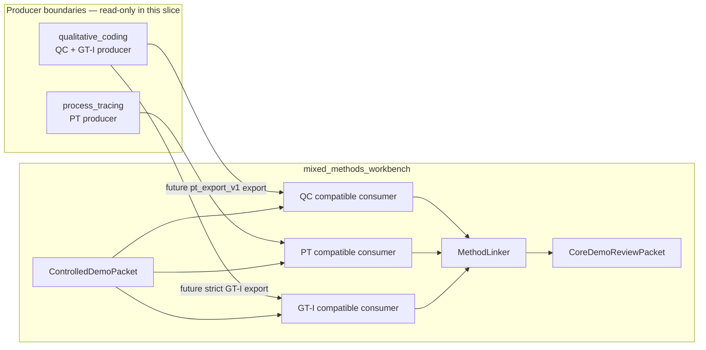
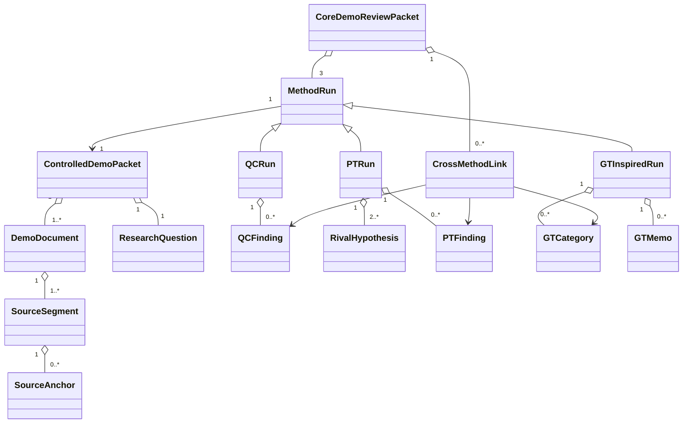
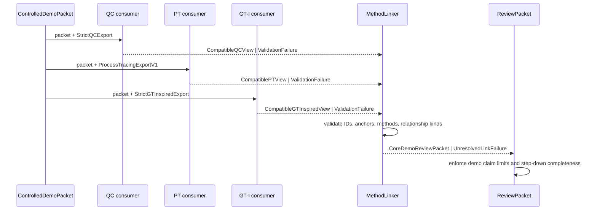

# Current Plan: DEMO Method-Core Contract and Review Mockup

Status: approved planning journey; implementation not yet authorized
Authorized by: Brian, “ok proceed,” 2026-07-12, in direct response to the
named `DEMO` next action  
Capability rows: `DEMO`, then dependency preparation for `QC-D`, `PT-D`,
`GT-D`, and `CORE-D`

## Mission

Specify and review the smallest controlled demonstration in which qualitative
coding (QC), process tracing (PT), and a grounded-theory-inspired (GT-I) lane
produce distinct, source-traceable outputs that a reviewer can compare without
mistaking the result for empirical validation or mixed methods.

## Authority and Scope

This authorization activates local planning and reversible workbench artifacts
for `DEMO`. It does not authorize changes in `qualitative_coding`,
`process_tracing`, or another producer repository. Producer work remains a
separate named authorization after this mockup and contract are approved.

In scope:

- demo requirements, boundaries, domain model, contract stubs, and failure
  semantics;
- a notebook that makes phase inputs/outputs and open questions concrete;
- a static review-packet mockup using explicitly synthetic values;
- a dependency-resolution readout for the GT-I producer seam;
- evidence-graded acceptance criteria and negative controls for a later
  implementation slice.

Out of scope:

- live producer runs, LLM calls, APIs, UI generators, adapters, or production
  schemas;
- selecting the final validation corpus;
- OntoCanon, DIGIMON, theory recommendation, Theory Forge, quantitative text,
  or mixed-methods integration;
- full-GT, empirical, methodological-validity, or SOTA claims.

## Frame and Modality

Goal: make the method distinctions tangible enough that Brian can approve the
first end-to-end workflow before engineering begins.

Constraints: current evidence is synthetic; producer exports are not stable;
PT has no `pt_export_v1`; QC has an accepted PT-handoff fixture but no general
workbench export; QC's GT path is explicitly GT-inspired rather than full GT.

Modality:

- **Deductive:** provenance, source anchoring, method identity, forbidden field
  leakage, claim limits, version failure, and review-packet traceability.
- **Exploratory:** whether the three-lane comparison is useful to a researcher,
  which GT-I objects deserve first-class display, and which disagreements need
  cross-method links.
- **Readout:** Brian can inspect one packet and correctly answer, for every
  finding, “which method produced this, what does it mean, what source supports
  it, and what is it not allowed to claim?” Ambiguity produces a mockup revision,
  not a stronger schema.

Borrow versus build:

- borrow QC/GT-I artifacts and method rules from `qualitative_coding`;
- borrow PT inference objects from `process_tracing` only through its future
  producer export;
- build only workbench-owned compatible consumers, linkage, and review views;
- do not introduce OntoCanon/DIGIMON until reviewed native outputs exist.

ADR 0004 records this scope/order decision.

## Requirements

1. One controlled packet has stable document, segment, anchor, and question
   identity across all lanes.
2. QC displays codes/categories, applications, claims/patterns, memos, review
   state, and negative/contrary evidence without PT support fields.
3. PT displays rival hypotheses, observable predictions, evidence/absence,
   comparative support, sensitivity, verdict language, and caveats without
   turning support into probability of truth.
4. GT-I displays constant-comparison iterations, category properties and
   dimensions, memos, category-development gaps, provisional core category or
   model, and theoretical-sampling suggestions. It must say that codebook
   convergence and category adequacy diagnostics are not saturation proof.
5. The combined packet compares outputs but never averages them or emits a
   generic confidence score.
6. Every displayed finding steps down to a method-native object and exact
   synthetic source anchor.
7. Unsupported versions, missing anchors, missing residual PT hypotheses,
   cross-method field leakage, and claims exceeding the demo scope fail loudly.

## Boundaries



| Boundary | Owns | Rules/invariants | Failure behavior | Must not own |
|---|---|---|---|---|
| Producer | Native method state and strict export | Strict schema; native IDs/provenance; method claim limits | Export fails before artifact publication | Workbench links or cross-method synthesis |
| Compatible consumer | Version support and loss report | Ignore compatible extras; reject unsupported major versions; never invent missing semantics | Typed validation error plus loss report | Producer inference or repair |
| Controlled demo packet | Shared synthetic sources/question/expected signals | Stable hashes/anchors; explicit software-only limits | Packet invalid | Real-corpus governance or empirical truth |
| Method linker | Explicit relationships between native objects | Link only by IDs and declared relationship kind; no scalar aggregation | Unresolved/invalid link is visible and blocks packet | Rewriting native artifacts |
| Review packet | Human/agent-readable comparison and step-down | Method labels, source links, caveats, disagreement and silence visible | Incomplete packet cannot be marked reviewable | Method validity or publishable inference |

## Domain Model



Key policy: `MethodRun` is a shared envelope, not a universal inference model.
Each subtype retains method-owned objects and permitted claims.

## Contract Stubs and Data Flow



| Contract | Producer → consumer | Minimum truthful stub | Allowed failures |
|---|---|---|---|
| `ControlledDemoPacket` | Workbench → all lanes | packet ID/version, question, documents/segments/hashes, anchors, expected planted signals, claim limits | malformed hash/anchor, unsupported version, empirical wording |
| `StrictQCExport` | QC → QC consumer | producer/version, packet binding, corpus denominator, anchors, codes/applications, claims/patterns, memos/review, caveats | not yet producer-approved; missing anchor; PT-field leakage |
| `ProcessTracingExportV1` | PT → PT consumer | producer/version, packet binding, rivals/residual, predictions, evidence/absence, support/sensitivity/verdict, caveats | seam absent; residual missing; probability-of-truth wording |
| `StrictGTInspiredExport` | QC → GT-I consumer | producer/version, packet binding, comparison iterations, categories/properties/dimensions, memos, core/model, sampling suggestions, diagnostics, caveats | export absent; saturation overclaim; no iteration provenance |
| `CoreDemoReviewPacket` | Workbench → reviewer | three method views, explicit links/disagreements/silences, source step-down, validation results, claim limits | any lane absent; unresolved link; generic score; missing caveat |

No production schema is derived yet. These broad stubs are the approved surface
for the mockup; exact Pydantic fields follow producer fixture inspection.

## Dependency Subplan: GT-Inspired Export

Blocks: `GT-D` and the three-lane `CORE-D` packet.

Known stub: `qualitative_coding` owns `ProjectState`, GT constant comparison,
axial/selective coding, theory integration, category adequacy diagnostics,
theoretical-sampling packages, and D8 protocol/result surfaces.

Unknowns: which fields form the smallest strict portable export; which objects
are runtime populated on a controlled packet; whether iteration/memo/category
IDs and source anchors survive without loss.

Instrument: after separate producer authorization, run one synthetic/shareable
GT-I project and export an inventory of populated native objects plus hashes,
then map it into the mockup without adding fields.

Readout: every GT-I panel value maps to one populated producer field and exact
source/iteration provenance; absent fields are explicitly unavailable; the
packet contains the required no-full-GT/no-saturation claim limits.

Promotion: replace `StrictGTInspiredExport` stub with producer-owned Pydantic
schema, compatible consumer, fixture, loss tests, and negative controls.

## Acceptance Criteria and Evidence Grades

| ID | Criterion | Evidence now → target for this planning slice | Pass/fail |
|---|---|---|---|
| D1 | Exact authorization, scope, and non-goals recorded | D → D/doc | Pass when this plan and status agree. |
| D2 | Requirements derive boundaries, domain objects, and contract stubs in order | F → D/doc | Pass when diagrams/tables resolve every named seam without invented internals. |
| D3 | GT ownership is evidence-backed and honestly named GT-inspired | F → D/doc | Pass when QC evidence and limitations are cited; no full-GT claim remains. |
| D4 | Static review packet makes the three methods distinguishable and source-steppable | D/doc | Brian approved the static mockup on 2026-07-12; runtime fixture evidence does not exist yet. |
| D5 | Failure taxonomy covers unsupported version, missing anchor/residual, leakage, aggregation, and overclaim | F → D/doc | Pass when each has a planned negative control and fail-loud result. |
| D6 | No producer or implementation mutation occurred | observed workspace check → A/test for scope only | Pass when repo diff is documentation/notebook only and producer HEADs remain unchanged. |

This planning slice does not promote QC/PT/GT capability evidence.

## Failure and Recovery Table

| Failure | Diagnostic | Next action |
|---|---|---|
| Mockup makes methods look interchangeable | Reviewer cannot identify method/meaning | Split panels/objects further; do not add explanatory prose alone. |
| GT-I appears to prove saturation | Diagnostic or codebook convergence shown as conclusion | Rename and expose missing theoretical-sampling/expert evidence. |
| Cross-method link implies support | Relationship lacks a typed neutral kind | Restrict to `addresses`, `challenges`, `contextualizes`, or `unresolved`; never auto-support. |
| Source step-down fails | Finding has no exact anchor/native ID | Block packet and repair producer fixture; no inferred anchor fallback. |
| Producer shape differs from stub | Loss inventory has unmapped required meaning | Revise mockup/contract through dependency subplan before adapter work. |
| Synthetic result reads as a finding | Claim-limit control fails | Change labels/content and add a negative control before proceeding. |

## Thin Slices

### Slice DEMO-P1 — Approve the contract journey

Advances: `DEMO` planning.  
Vertical scope: source packet → three native views → cross-method comparison →
source step-down, rendered in the notebook/static mockup.  
De-risks: wrong product/interface and GT ownership.  
Success: Brian approves or requests concrete revisions to the mockup.  
Audit: try to misread each panel as another method, full GT, empirical evidence,
or mixed methods.  
Cleanup: remove competing case-first next-action language; triage concerns.  
Done when: mockup decision recorded, findings dispositioned, docs/checks clean.

### Slice DEMO-P2 — Producer fixture authority (future, separately authorized)

Advances: `QC-D`, `PT-D`, `GT-D`.  
Vertical scope: one controlled packet through each producer-owned strict export
and workbench compatible consumer.  
De-risks: invented contracts and lossy adapters.  
Success: strict fixtures validate, consumers tolerate compatible extras, and
negative controls fail on method leakage/overclaim.  
Audit/cleanup: independent seam review, fixture provenance, producer/workbench
commit pins, concern triage.  
Done when: all three fixture lanes pass and no producer-internal parsing exists.

## Mockup Approval Gate

The cross-seam mockup is `docs/plans/demo_method_core_mockup.md`; the full phase
journey is `notebooks/demo_method_core_plan.ipynb`.

Gate status: **approved by Brian on 2026-07-12**. This approves the target
review journey and closes the human mockup gate. It does not by itself
authorize the separately named `DEMO-C1` local contract/fixture implementation
slice or any producer-repository mutation.

## Verification

```bash
make check
make coverage
make coverage-json
git diff --check
git status --short --branch
git -C ~/projects/qualitative_coding rev-parse HEAD
git -C ~/projects/process_tracing rev-parse HEAD
```

Expected: all scaffold checks remain green; evidence grades do not move;
changes are planning artifacts only; producer HEADs remain unchanged.
