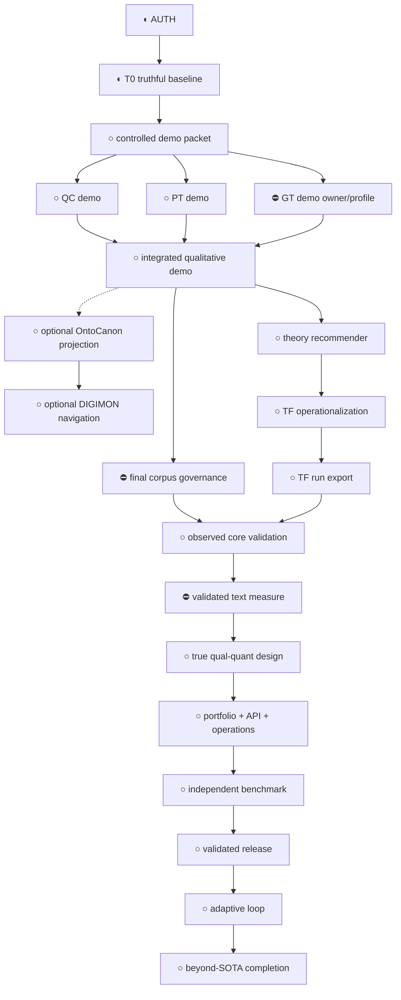

# Goal: A Validated SOTA-or-Beyond Mixed Methods Workbench

Created: 2026-07-12
Status: active long-term program; no implementation slice is currently authorized
Owner: `mixed_methods_workbench` for integration; producer owners retain their own invariants

## North Star

Researchers can move from a governed text corpus to methodologically faithful,
reproducible, and independently validated mixed-methods meta-inferences, with
every source, transformation, disagreement, decision, and claim limit open to
human and agent inspection.

This is a bounded product claim, not a promise to automate every research
tradition. “All areas” means every declared capability in the supported release
profile; unsupported methods, languages, domains, and designs remain explicit.

## Sources

This goal is derived from:

- `~/projects/investigations/mixed_methods_workbench/2026-07-12-sota-program-baseline.md`;
- `.claude/tasks/research_artifact_authority.md`;
- `.claude/tasks/research_producer_readiness.md`;
- `.claude/tasks/research_sota_landscape.md`;
- `.claude/tasks/research_gov_case_options.md` and
  `.claude/tasks/research_qt_first_task_options.md`;
- `PROJECT.md`, `docs/MIXED_METHODS_CAPABILITY_MAP.md`, `docs/ROADMAP.md`,
  `docs/CAPABILITY_DEPENDENCY_GRAPH.md`, `docs/PLANNING_STATUS.md`, and
  `docs/PRE_IMPLEMENTATION_CHECKLIST.md`;
- `docs/decisions/2026-07-12-first-governed-case.md` and
  `docs/decisions/2026-07-12-first-quantitative-text-strand.md`;
- the exact producer and external source inventories recorded in the research
  reports above.

## Goal Map

| Goal | Team-legible outcome | Current state | Completion evidence |
|---|---|---|---|
| G1. Trustworthy evidence | A reviewer can trace every claim through governed sources, transformations, and decisions. | Synthetic scaffold; F overall | Observed real projects, deliberate provenance failures, rights/access review, and independent replay. |
| G2. Faithful method strands | Qualitative, process-tracing, and quantitative-text work each follows its own validity rules. | Producer capability exists unevenly; workbench D/F | At least one validated path per required strand, versioned method profiles, expert error review, and known limits. |
| G3. Explicit integration | The system connects, builds, merges, embeds, or transforms qual and quant strands and records what the relationship means. | F | An observed qual–quant design with joint display, divergence disposition, and bounded meta-inference. |
| G4. Reproducible collaboration | Humans and agents use the same typed operations and can package, inspect, rerun, and exchange a study. | D/F | Versioned bundle, OpenAPI parity, audit trail, loss ledger, same-environment replay, and independent clean-room replay. |
| G5. Governed assistance | Automation and LLM roles are named, bounded, source-anchored, monitored, and reviewable. | D | Role/risk profiles, immutable run lineage, planted failures, override/error analysis, and privacy/security review. |
| G6. Demonstrated advantage | The workbench is at least as rigorous as refreshed incumbents on every claimed dimension and materially better on at least one. | F | Frozen and sealed cases, incumbent baselines, uncertainty, ablations, independent raw-trace review, and signed bounded claims. |
| G7. Beyond-SOTA learning loop | The workbench can recommend a discriminating next source, case, or analysis without hiding uncertainty or taking over direction. | F | A preregistered adaptive-loop experiment beats a non-adaptive baseline without lowering method fidelity or governance. |

No average score can close these goals. Every applicable floor must pass.

## What Exists and What Is Still Needed

### Exists

- a broad product thesis and method-aware capability inventory;
- a dependency and version ladder;
- explicit separation of QC, PT, theory, quantitative effects, and
  mixed-methods meta-inference;
- executable synthetic fixtures with targeted negative controls;
- independently signed W2 inventory provenance with evidence-derived coverage;
- an honest overall F program scorecard alongside bounded scaffold coverage;
- producer implementations that can seed future exports;
- a current external and incumbent landscape review.

### Needed

- remaining typed-contract, readiness-manifest, and real-export T0 evidence;
- a controlled software-only demonstration packet;
- strict producer-owned QC and PT exports, a method-faithful GT owner/export,
  and compatible consumers;
- one demo multi-method qualitative reviewer packet before final corpus choice;
- optional OntoCanon projection and DIGIMON evidence navigation over reviewed
  findings, without replacing native artifacts;
- a governed, source-backed theory recommender with human selection;
- separate Theory Forge operationalization and executed-run exports;
- study/source governance and a licensed validation corpus selected after the
  demo, followed by observed core-method validation;
- a selected quantitative-text task, construct, corpus, owner, and held-out
  evaluation;
- one observed true mixed-methods design;
- method profiles, versioned bundles, exchange tests, and typed agent parity;
- independent multi-domain evaluation and one validated adaptive frontier
  experiment.

## Dependency Map

Legend: ✅ observed/complete, ◐ partial or documented, ○ missing, ⛔ blocked by
a decision or authorization.



Critical path to the validated 1.0 release:

```text
AUTH -> T0 -> DEMO -> QC + PT + GT -> CORE-D -> TREC -> TF-SPEC -> TF-RUN
-> GOV -> CORE-V -> QT -> MM -> PORT + API -> EVAL -> V10
```

Post-1.0 frontier path for this broader program goal:

```text
EVAL + V10 -> ADAPT -> V2X
```

OntoCanon/DIGIMON are optional infrastructure branches. Grounded Research is an
optional adjudication service and is not grounded theory. A minimal qual–quant
mixed-methods claim need not use Theory Forge, but the planned full product
sequence includes source-backed theory recommendation and both Theory Forge
export seams before final validation. See ADR 0004.

## Risk-Ordered Work Packages

Each work package is a thin end-to-end claim increment, not a component dump.

| WP | Thin slice | Entry | Exit/readout | Authority now |
|---|---|---|---|---|
| WP0 | Truthful synthetic provenance and evidence-derived inventory | Current scaffold | W2 changes when evidence changes; exact negative control fires; fixture grades stay ≤C; T0 remains partial | Completed and independently signed off as `T0-PROV` |
| WP1 | Controlled demo packet | WP0 plus named authorization | Small synthetic/rights-clear sources, expected signals, anchors, and software-only claim limits pass | Not authorized |
| WP2 | Separate QC/PT/GT demo lanes | WP1 plus producer/profile authorization | Method-native outputs and method-specific negative controls pass; GT ownership is explicit | Blocked on GT owner and named authorization |
| WP3 | Integrated qualitative demo review | WP2 | Question -> source -> distinct QC/PT/GT findings -> disagreement/caveat is inspectable without a generic score | Not authorized |
| WP4 | Optional governed knowledge/navigation | WP3 | Selected findings round-trip through OntoCanon and pinned DIGIMON evidence views to native artifacts/sources | Not authorized; optional branch |
| WP5 | Theory recommendation and Theory Forge application | WP3; WP4 optional | Cited shortlist, human decision, frozen operationalization, and typed staged run are reviewable | Blocked on governance/export decisions |
| WP6 | Governed corpus and observed core validation | WP3 and WP5 for full profile | Rights/scope/denominator pass; real QC/PT/GT findings and theory challenges survive method-specific review | Final corpus deliberately deferred |
| WP7 | Validated quantitative-text strand | WP6 plus task/owner/construct decisions | Held-out baselines, uncertainty, leakage controls, errors, and item links pass | Later decision |
| WP8 | One explicit mixed-methods case | WP7 | Build/merge operation, joint display, divergence resolution, bounded meta-inference, expert review | Not authorized |
| WP9 | Portfolio, governance, exchange, and agent parity | WP8 | Named profiles, exchange loss tests, reproducible bundle, typed API parity | Not authorized |
| WP10 | Independent SOTA evaluation and adaptive frontier | WP9 | Frozen incumbents/cases plus independent sign-off; adaptive policy later beats non-adaptive baseline within floors | Not authorized |

## Evidence and Decision Rules

- Advance evidence in order: `doc -> fixture -> schema_validated -> test -> observed`.
- A synthetic fixture can never exceed C for claims about real behavior.
- Before a hard gate: publish current coverage, add a known-positive and
  intended known-negative, then enforce.
- Every statistical or LLM criterion names its construct, task, split,
  incumbent, metric, uncertainty, margin, slices, and expiration trigger.
- Every SOTA decision gets an independent adversarial sign-off based on raw
  artifacts and traces; the reviewer can reject it.
- Freeze a finite mandatory release/benchmark profile before results: methods,
  designs, domains, languages, tasks, primary dimensions, strongest relevant
  incumbents, human/simple baselines, margins, noise/power rationale,
  multiplicity control, sealed-case custodian, and N/A exclusions. Independent
  approval is required, and the scope cannot shrink after results are visible.
- “Useful,” “rigorous,” “high quality,” and “agent-drivable” are not acceptance
  criteria without an observable readout.
- A failed exploratory readout produces a finding and next experiment, not a
  silent fallback or a forced production contract.

## Stop Points That Need Human Direction

Only these current decisions cannot be safely inferred:

1. whether to authorize the named controlled `DEMO` slice;
2. which producer/owner and method profile supply grounded theory;
3. theory-library/search governance and human selection rules;
4. later, which final validation corpus to govern (FRUS remains a candidate);
5. later, the quantitative-text task, owner, and exact construct;
6. future permission for each producer-repository slice and the final
   benchmark's sealed-case custodian/public-claim threshold.

All documentation, investigation, negative-control design, and reversible local
work within an already named slice should continue without pausing.

## Completion Condition

The long-term goal is complete only when the transcript and repository show:

1. all declared V10 capabilities have owners, supported scopes, versioned
   contracts, current evidence, and known limits;
2. at least one real qualitative path, one rival-sensitive PT path, one
   quantitative-text path, and one explicit qual–quant integration design have
   observed evidence;
3. every released claim is source-to-meta-inference traceable and governed;
4. a third party reproduces a packaged release from a clean environment;
5. human and agent operations have tested semantic parity and auditability;
6. a fresh independently preregistered benchmark over an immutable mandatory
   profile finds no material regression against the strongest relevant named
   incumbent on any primary dimension and a meaningful predeclared gain on at
   least one, with uncertainty, power/noise rationale, multiplicity control,
   human/simple baselines, and sealed-case custody recorded;
7. one adaptive next-step experiment passes its preregistered safety, fidelity,
   and utility readout;
8. unsupported methods/domains/languages and expired evidence are explicit;
9. all changes are reviewed, verified, committed, pushed, and the working lanes
   are clean.

## `/goal` Invocation

```text
/goal Bring mixed_methods_workbench to an independently validated SOTA-or-beyond state across its declared text-centered mixed-methods release scope. Preserve method boundaries: QC discovers/anchors patterns; PT compares rival within-case explanations; theory guides but is not evidence; mixed methods requires explicit qual-quant integration and bounded meta-inference. Work dependency-first in thin, versioned slices. Before each slice, refresh repo/producers/claims, record its named authorization, acceptance evidence and failure modes, update docs/concerns, and stop only for an irreversible shared-state action or a genuine undecided architectural choice. Use producer-owned strict Pydantic exports and permissive compatible workbench consumers; never parse engine internals. Advance evidence honestly doc->fixture->schema_validated->test->observed; synthetic evidence is at most C. Publish coverage and known-positive/known-negative controls before enforcement. Treat analytic quality as method/task/domain specific; instrument exploratory surfaces rather than invent universal thresholds. Every released result must preserve source/governance/run/reviewer provenance and claim limits, support clean replay, and have typed human/agent operation parity. Before any benchmark decision or SOTA claim, freeze an immutable mandatory scope, strongest relevant incumbents plus human/simple baselines, primary dimensions, margins, power/noise rationale, multiplicity controls, and sealed-case custodian; prohibit post-result scope shrinkage; use held-out evidence/raw traces and independent sign-off with rejection authority. Continue safe authorized work autonomously, commit and push every verified increment, and keep the program tracker current. Done only when: all declared V10 capabilities have owners/contracts/current evidence/limits; real observed qualitative, PT, quantitative-text, and explicit qual-quant paths exist; a third party clean-room reproduces the release; API/UI/CLI/agent parity is tested; an independent fresh comparison shows non-inferiority on every claimed dimension and a meaningful predeclared gain on at least one; one adaptive next-source/case/analysis experiment beats a non-adaptive baseline within fixed governance and method-fidelity floors; unsupported or expired areas are explicit; and all changes are reviewed, verified, committed, pushed, and clean. T0-PROV/W2 is completed and signed off; it did not close T0, no implementation slice is currently authorized, and producer repos/later slices remain read-only until separately named.
```

## Currency

- Program snapshot: 2026-07-12.
- Refresh producer state at every slice entry.
- Refresh software/incumbent baselines within six months or on a relevant major
  release; refresh methodological reviews within twelve months or on a material
  new review/standard.
- The current score and evidence expirations live in
  `docs/SOTA_EVIDENCE_SCORECARD.md`.
